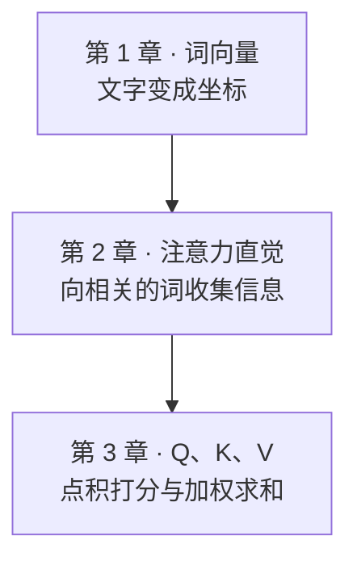
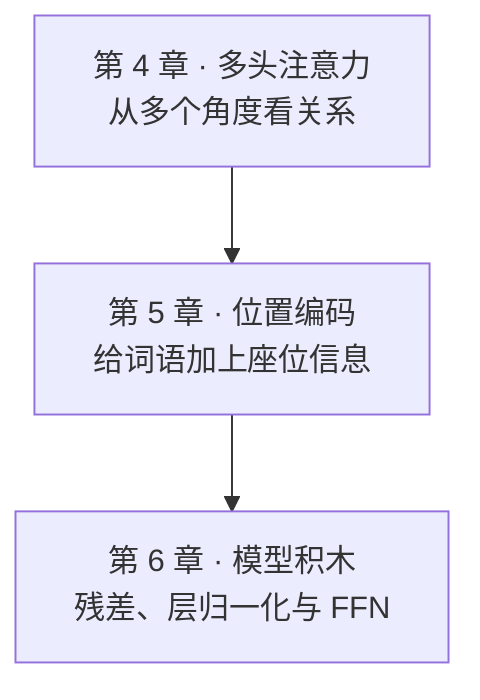
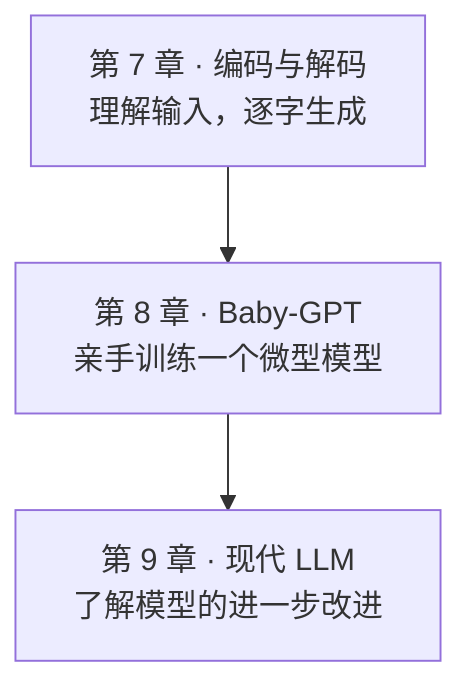

# 前言与阅读指南：写给初学者的大模型极简数学与代码之旅

> “任何足够先进的技术，初看都与魔法无异。” —— 亚瑟·C·克拉克

---

## 为什么写这本书？

你可能每天都在使用 ChatGPT、Claude 或 DeepSeek。你可以让它帮你写代码、构思作文、翻译古文，甚至推导一道物理大题。当你看着屏幕上的光标像打字机一样，一个字一个字、行云流水地“吐”出深刻而富有逻辑的回答时，你是否曾产生过强烈的好奇：

- **这个黑盒子的肚子里到底在发生什么？**
- **它是真的“拥有人类的思想”，还是在进行某种精妙绝伦的数学魔术？**
- **我只是一个编程与数学初学者，只懂一点平面向量、三角函数和基础 Python，我能彻底搞懂大模型的底层原理吗？**

答案是：**完全可以，而且远比你想象的更直观、更优美！**

今天大模型世界所有奇迹的基石，源于 2017 年 Google 团队发表的一篇划时代论文——**《Attention Is All You Need》（注意力就是你所需要的一切）**。在这篇论文中，作者们提出了一种名为 **Transformer** 的全新架构。

然而，市面上绝大多数 Transformer 教程都充斥着大学高阶微积分、抽象代数、复杂的流形几何与令人望而生畏的张量运算符号。这让许多初学者望而却步，误以为非得读完数学系研究生才能理解。

**这本书就是为你量身打造的解药。**

---

## 阅读前需要哪些准备

下面列出本书会用到的知识。遇到不熟悉的概念，可以先跟着例子计算，再回看公式：

1. **数学工具**：
   - **基础平面向量**：知道什么是向量 $\vec{a} = (x, y)$，知道向量相加是平行四边形法则，知道什么是模长 $|\vec{a}|$，以及两个向量的**点乘（数量积）** $\vec{a} \cdot \vec{b} = x_1 x_2 + y_1 y_2 = |\vec{a}| |\vec{b}| \cos\theta$。
   - **基础三角函数**：知道正弦波 $\sin(x)$ 和余弦波 $\cos(x)$ 的周期与图像。
   - **初等代数与统计**：知道自然底数 $e \approx 2.718$ 的指数函数 $e^x$，知道均值 $\mu$ 与方差 $\sigma^2$。
   - **完全不需要**：高等微积分、泛函分析、实变函数、群论或微分几何！遇到矩阵乘法等新概念时，本书会把它拆成一组组点积，配合具体数字说明。

2. **代码阅读**：
   - 只要你能看懂 Python 的变量、`for` 循环、`if` 条件判断、列表 `[1, 2, 3]` 以及定义简单函数 `def func(x):` 即可。
   - 关键步骤先用**纯 Python 手算版**建立直觉，再逐步过渡到 PyTorch 张量代码。你可以先用草稿纸核对数字，再运行完整实验，不需要一开始就记住所有库函数。

---

## 本书的学习法则

在阅读本书时，请牢记三个学习原则：

> **三大认知原则**：先建立直觉，再看懂几何，最后亲手运行代码。

1. **直觉大于公式**：
   当看到 $\text{Softmax}\left(\frac{QK^T}{\sqrt{d_k}}\right)V$ 时，不要慌张。在本书中，它会变成“你在图书馆借书、拿着检索词在书库贴标签卡、最后把借出的书本知识综合起来”的故事。
2. **几何优于抽象**：
   词语不是冰冷的字符串，而是高维空间里自由飞翔的“箭头”。“国王 - 男人 + 女人 = 女王”不是修辞手法，而是向量平移的真实几何奇迹。
3. **动手胜过死记**：
   第 1、3、4、5、6、8 章配有可以在电脑上运行的脚本。其余章节用生活例子、图和手算把道理讲完。请亲手跑一遍第 8 章：你会看到模型把三首短诗背下来，也会看到换一个没学过的开头时它立刻露馅。

---

## 全书路线图

我们将带你像拼乐高积木一样，从最小的零件开始，一步步搭建出整座大模型城堡：

先走完三个小阶段。每张路线图只保留三章，读完一张，再进入下一张。

准备好你的好奇心与草稿纸，让我们正式开启这段激动人心的探索之旅！
