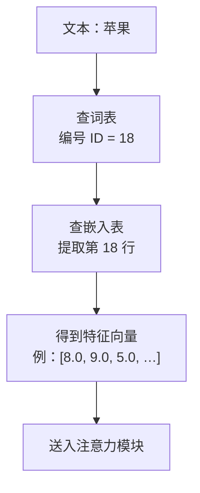

# 第1章：从词语到数学世界——词嵌入（Word Embedding）与空间向量

> “世间万物皆有其空间位置，人类的语言亦不例外。”

---

## 1.1 计算机如何读懂文字？从“查字典”到“特征打分”

想象一下，你必须教会一台只能做四则运算（加减乘除）的计算器去阅读《西游记》。

计算机的芯片是硅晶片构成的电路，它天然只认识电位的高和低——也就是 **0 和 1**。它根本不知道什么是“苹果”，什么是“孙悟空”，更读不懂李白的“床前明月光”。

要让计算机处理语言，第一步必须是：**把字词翻译成数字**。

### 方案 1：给字典里的每个字编个号码？（朴素标号法）

很多初学编程的朋友第一反应是：这还不简单？买一本《新华字典》，按页码给每个字排个座次：

- 苹果 $\to 1$
- 梨子 $\to 2$
- 飞机 $\to 3$
- 导弹 $\to 4$

这种方法看似聪明，却会导致荒谬的数学灾难：

1. **强加的大小关系**：在数学里，$2 > 1$。难道“梨子”比“苹果”更“大”？难道“导弹”的大小是“飞机”加上“梨子”？
2. **扭曲的距离关系**：根据标号，$\text{梨子}(2) - \text{苹果}(1) = 1$，而 $\text{导弹}(4) - \text{飞机}(3) = 1$。这岂不是意味着在电脑眼里，“梨子和苹果的亲密程度”竟然与“导弹和飞机的亲密程度”完全一模一样？

显然，一个单一的标量（单数）根本承载不了人类语言中千丝万缕的复杂语义。

---

### 方案 2：全班点名册的窘境（One-Hot 独热编码）

后来，计算机科学家想到了另一种方法：假设我们的词表里一共有 10,000 个不同的词。我们准备一个长为 10,000 的长条数组，谁出场，谁对应的那个位置就写 1，其他人全部写 0：

- 苹果：$[1, 0, 0, 0, 0, \dots, 0]$
- 梨子：$[0, 1, 0, 0, 0, \dots, 0]$
- 香蕉：$[0, 0, 1, 0, 0, \dots, 0]$
- 宇宙：$[0, 0, 0, 0, 0, \dots, 1]$

这种编码方式被称为 **One-Hot（独热）编码**。它虽然解决了“谁大谁小”的乱序问题，却带来了更致命的缺陷：

> [!WARNING]
> **几何正交悲剧**：
> 先看向量点积的计算方式：
> $$\vec{a} \cdot \vec{b} = a_1 b_1 + a_2 b_2 + \dots + a_n b_n$$
> 在 One-Hot 编码下，任何两个不同的词向量，它们每一位对应相乘的结果必然全都是 0！
> $$\vec{v}_{\text{苹果}} \cdot \vec{v}_{\text{梨子}} = 0$$
> $$\vec{v}_{\text{苹果}} \cdot \vec{v}_{\text{宇宙}} = 0$$
> 
> 在几何上，这意味着**所有词与词之间都是 90 度互相垂直的（正交）**。在电脑眼里，“苹果”和“梨子”的关系，居然跟“苹果”和“宇宙”一样疏远冷漠！

---

## 1.2 用平面向量给词语画像：建立“特征坐标系”

怎样才能让电脑既不产生大小误解，又能看懂“苹果”和“梨子”很近，而“苹果”和“汽车”很远呢？

可以借助**平面向量**：给每种水果一组坐标，再比较它们的位置。

让我们在平面上建立一个直角坐标系，但我们不叫它 $X$ 轴和 $Y$ 轴，而是给它们赋予鲜明的现实特征：

- **横坐标（维度 0）**：表示水果的 **“甜度”**（打分范围 0 到 10）
- **纵坐标（维度 1）**：表示水果的 **“脆度”**（打分范围 0 到 10）

现在，我们把各种水果放到这个坐标系中：

```
脆度 (Y轴)
  10 ▲
   9 ┼                 ● 苹果 (8, 9)
   8 ┼                   ● 梨子 (7.8, 8.5)
   7 ┼
   6 ┼
   5 ┼
   4 ┼
   3 ┼            ● 西瓜 (9, 3)
   2 ┼
   1 ┼   ● 香蕉 (8.5, 1)
   0 ┼─────────────────────────────────► 甜度 (X轴)
     0   1   2   3   4   5   6   7   8   9   10
```


### 表 1-1：One-Hot 独热编码 vs 稠密词向量（Dense Embedding）全面对比表

| 对比维度 | One-Hot 独热编码 | 稠密词向量 (Embedding) |
| :--- | :--- | :--- |
| **向量形式** | 绝大多数是 0，只有一个 1（稀疏长条） | 全是连续实数，如 `[0.25, -1.34, 0.88]` |
| **典型向量长度** | 词表有多大就多长（如 100,000 维） | 紧凑精炼（通常 512 或 4096 维） |
| **两两点积结果** | **恒等于 0**（所有词互相正交垂直） | **反映真实语义**（近义词点积大，反义词点积负） |
| **内存与算力开销**| 巨大浪费（全是在乘无意义的 0） | 极致紧凑高效，GPU 矩阵加速顺畅 |
| **表达未知新词** | 毫无泛化能力 | 可通过空间插值获得合理的近似语义 |

---

### 表 1-2：5 种水果的三维特征评分与空间几何度量数据表

以基准词 **“苹果 (8.0, 9.0, 5.0)”** 为例进行距离与相似度计算：

| 水果名称 | 甜度 (X) | 脆度 (Y) | 价格 (Z) | 模长 \|v\| | 与苹果的欧氏距离 | 与苹果的余弦相似度 cos(θ) | 语义判定 |
| :--- | :---: | :---: | :---: | :---: | :---: | :---: | :--- |
| **苹果 (Apple)** | **8.0** | **9.0** | **5.0** | **13.04** | **0.0000** | **1.0000 (100%)** | **基准完全重合** |
| **梨子 (Pear)** | 7.8 | 8.5 | 4.8 | 12.51 | 0.5745 | **0.9999 (99.9%)** | **高度亲缘近义词** |
| **西瓜 (Watermelon)** | 9.0 | 3.0 | 1.5 | 9.60 | 7.0178 | **0.8504 (85.0%)** | 甜度相似但脆度有别 |
| **黄瓜 (Cucumber)** | 1.0 | 8.0 | 2.0 | 8.31 | 7.6811 | **0.8310 (83.1%)** | 脆度相似但完全不甜 |
| **香蕉 (Banana)** | 8.5 | 1.0 | 3.5 | 9.25 | 8.1548 | **0.7838 (78.4%)** | 软糯无脆度，距离最远 |



观察这个图与数据表，奇迹出现了：

1. **苹果** 的坐标是 $(8, 9)$，**梨子** 的坐标是 $(7.8, 8.5)$。它们在空间中几乎挨在一起！
2. **香蕉** 虽然也很甜 $(8.5)$，但它软糯不脆 $(1.0)$，所以它落在了右下角。
3. 只要计算它们在坐标系里的相对位置，电脑就能通过简单的加减乘除，立刻“心领神会”谁是谁的亲戚！

这就是现代大模型的基石——**词嵌入（Word Embedding，也称词向量）**：
> **词向量**：将大千世界里的每一个词，映射为一个高维空间里的多维坐标点（一个有方向的箭头）。每个维度，都暗中代表着这个词在某种特征上的测量值！

---

## 1.3 空间向量的几何度量：为什么点乘与余弦是天作之合？

我们可以从距离和夹角两个角度，衡量向量之间的关系：

### 1. 欧氏距离（平面两点距离公式）

$$d(\vec{a}, \vec{b}) = \sqrt{(x_1 - x_2)^2 + (y_1 - y_2)^2}$$

距离越小，两点越近。但欧氏距离有一个缺点：如果一个词出现的词频极高，向量被整体拉长，点就会离原点很远，从而影响距离的判断。

### 2. 余弦相似度（夹角余弦）

两个向量的点积可以用它们的长度和夹角表示：
$$\vec{a} \cdot \vec{b} = |\vec{a}| |\vec{b}| \cos\theta$$

我们稍作变形，就能解出夹角的余弦值：
$$\cos\theta = \frac{\vec{a} \cdot \vec{b}}{|\vec{a}| |\vec{b}|} = \frac{x_1 x_2 + y_1 y_2}{\sqrt{x_1^2 + y_1^2} \sqrt{x_2^2 + y_2^2}}$$

根据余弦函数的性质：
- 当 $\theta = 0^\circ$ 时，$\cos 0^\circ = 1$：两个箭头**完全同向**，代表两个词的含义高度一致！
- 当 $\theta = 90^\circ$ 时，$\cos 90^\circ = 0$：两个箭头**相互垂直**，代表两个词风马牛不相及！
- 当 $\theta = 180^\circ$ 时，$\cos 180^\circ = -1$：两个箭头**方向完全相反**，代表它们在语义上几乎互为反义词！

> [!NOTE]
> **敲黑板**：
> 在 Transformer 和大语言模型中，几乎所有注意力打分、向量检索，核心都是在算**向量点积（Dot Product）**！点积的本质，就是在算这两个向量“在多大程度上心有灵犀（同向发力）”。

---

## 1.4 神奇的向量加减法：国王 - 男人 + 女人 = 女王

如果词向量仅仅能用来算相似度，那还不足以被称为“大模型的魔法”。词向量最震撼科学界的一幕，是它支持**几何平移与逻辑运算**！

假设我们有以下四个词向量，每个向量有 3 个特征维度：
`[权力地位 (0~10), 男性特征 (-10~+10), 年龄成熟度 (0~10)]`

- 国王 (King)  = $[9.0, \ \ 8.0, \ 7.0]$
- 男人 (Man)   = $[1.0, \ \ 8.0, \ 5.0]$
- 女人 (Woman) = $[1.0, -8.0, \ 5.0]$
- 女王 (Queen) = $[9.0, -8.0, \ 7.0]$

现在，让我们用向量加减法做一个小实验：
$$\vec{v}_{\text{运算结果}} = \vec{v}_{\text{国王}} - \vec{v}_{\text{男人}} + \vec{v}_{\text{女人}}$$

让我们逐个分量计算：
- 维度 0（权力）：$9.0 - 1.0 + 1.0 = 9.0$ （依然拥有至高无上的权力！）
- 维度 1（性别）：$8.0 - 8.0 + (-8.0) = -8.0$ （脱去了男性特征，换成了女性特征！）
- 维度 2（年龄）：$7.0 - 5.0 + 5.0 = 7.0$ （依然保持成熟的君主仪态！）

运算结果向量为：$[9.0, -8.0, 7.0]$。
上面的女王坐标是按这个结果写好的，所以相似度会精确等于 1。
这是一个玩具例子，用来看清著名的 Word2Vec 现象：真实语料里学出来的向量只能**近似**满足“国王 - 男人 + 女人 ≈ 女王”，不会每个小数都对上。

```
        ▲ 权力维度
        │
  [女王]│●───────────────● [国王]
        ││               │
        ││-男人 +女人    │
        ││               │
        │▼               │
  [女人]│●───────────────● [男人]
        └────────────────────────► 性别维度 (左女右男)
```

这个例子可以用**平行四边形定则**理解：向量的加减对应坐标的移动。在训练得到的词向量中，一些语义关系也会表现为近似的位移方向，但并非所有关系都能这样表示。

---

## 1.5 手把手代码：纯 Python 验证词向量与相似度

让我们打开配套代码 [code/01_vector_similarity.py](../code/01_vector_similarity.py)，把点积、模长和余弦相似度写成 Python 函数。这个实验只需要标准库，下面逐步说明实现方法：

```python
import math

def dot_product(vec_a, vec_b):
    """
    计算两个向量的点积（内积）
    点积的坐标公式：a · b = x1*x2 + y1*y2 + ... + xn*yn
    """
    assert len(vec_a) == len(vec_b), "两个向量的维度必须完全相同！"
    total = 0.0
    for i in range(len(vec_a)):
        total += vec_a[i] * vec_b[i]
    return total

def vector_magnitude(vec):
    """
    计算向量的模长（也就是箭头的长度）
    模长公式：|a| = √(x1² + x2² + ... + xn²)
    """
    sum_of_squares = 0.0
    for val in vec:
        sum_of_squares += val ** 2
    return math.sqrt(sum_of_squares)

def cosine_similarity(vec_a, vec_b):
    """
    计算余弦相似度 cos(θ) = (a · b) / (|a| * |b|)
    """
    dot = dot_product(vec_a, vec_b)
    mag_a = vector_magnitude(vec_a)
    mag_b = vector_magnitude(vec_b)
    if mag_a == 0 or mag_b == 0:
        return 0.0
    return dot / (mag_a * mag_b)
```

运行该脚本后，控制台会输出：

```text
基准词：苹果 (Apple)，坐标向量为：[8.0, 9.0, 5.0]

目标词语           | 余弦相似度 (越高越近)  | 欧氏距离 (越小越近)
------------------------------------------------------------
梨子 (Pear)      |        0.9999        |     0.5745     
西瓜 (Watermelon)|        0.8504        |     7.0178     
黄瓜 (Cucumber)  |        0.8310        |     7.6811     
香蕉 (Banana)    |        0.7838        |     8.1548     
```

同时，运算结果和事先写好的女王向量，余弦相似度是 **1.0000**。脚本会直接告诉你：这是配出来的例子，不是词典查询的巧合。按余弦相似度排序，和苹果差得最远的是香蕉，不是黄瓜。

---

## 1.6 本章小结与思考题

1. **本章核心收获**：
   - 计算机读懂文字的第一步，是将词语映射为多维特征空间里的向量（箭头）。
   - 两个词语越相似，它们在空间里的夹角越小，点积和余弦相似度越接近 1。
   - 语言中蕴含的复杂逻辑，可以通过几何空间的加减法（向量平移）实现。

2. **课后思考题**：
   - 如果一个词在不同语境下有完全不同的含义，比如“我买了一斤苹果（水果）”和“我买了一台苹果（电脑）”，静态的词向量能区分它们吗？
   - 如果不能，我们该如何让词向量根据周围的同伴，动态地“改变自己的形状”呢？

带着这个问题，让我们迈向下一章：**注意力机制的直觉与诞生**！
