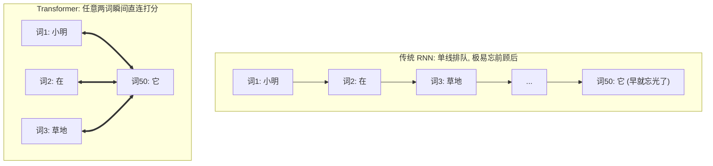

# 第2章：注意力机制的直觉——为什么我们需要“注意力”？

> “如果一个词在字典里只有一个死板的坐标，那它就永远无法理解人类多姿多彩的心灵。”

---

## 2.1 静态词向量的死穴：一词多义的尴尬

在第 1 章中，我们见证了词向量的几何魅力：每一个词都是高维空间里的一个漂亮箭头。

然而，现实生活中的人类语言有一个巨大的“陷阱”——**一词多义（Polysemy）与语境依赖**。

请看下面两句话：
1. **“秋天到了，红富士**苹果**又脆又甜。”**
2. **“乔布斯在发布会上推出了新款**苹果**手机。”**

在这两句话中，都出现了“苹果”这个词。但只要是通晓汉语的人，瞬间就能明白：
- 第一句里的“苹果”，指的是长在树上的多汁水果；
- 第二句里的“苹果”，指的是估值数万亿美元的科技巨头和电子设备！

然而，在传统的静态词向量（如 Word2Vec）世界里，**每个词在坐标系里的位置是终生固定的**。查词表时，“苹果”永远只有那一个坐标 $[8.0, 9.0, 5.0]$。

```
   传统静态词向量：
   [苹果] 永远只有一个死板坐标 ───► (8.0, 9.0, 5.0) 
   （不管是水果店还是科技发布会，都是同一个数字）

   理想的智能词向量：
   语境 A (水果店) ────────► [苹果] 动态变形为 [多汁, 甜度, 农产品] 向量
   语境 B (发布会) ────────► [苹果] 动态变形为 [科技, 芯片, 高端电子] 向量
```

如果模型无法根据**一句话里的其他词（上下文）**来动态调整这个词的含义，机器翻译、文本理解和聊天机器人就会闹出天大的笑话（比如把“我买了一部苹果”翻译成“I bought a fruit”）。

---

## 2.2 传统时代的传话游戏：RNN 的长距离遗忘症

在 Transformer 诞生之前，人工智能领域统治自然语言处理长达数年的是 **RNN（循环神经网络）** 及其变体 **LSTM**。

RNN 处理一句话的方式，非常像小学课间玩过的**“传话游戏”**：

```
 [小明] ───► [在] ───► [草地上] ───► [给] ───► [小狗] ───► ... ───► [它]
   │          │           │           │          │                  │
 记忆箱1 ──► 记忆箱2 ───► 记忆箱3 ───► 记忆箱4 ──► 记忆箱5 ───...───► 最终记忆箱
```

它的工作逻辑是：
1. 读入第 1 个词“小明”，把信息塞进一个小小的“记忆箱（隐藏状态）”；
2. 读入第 2 个词“在”，把“在”和之前的记忆箱混合，更新记忆箱；
3. 一直传下去，直到读完最后一个词。

这种设计有两大致命硬伤，直接把 AI 科学家们逼入了绝境：

### 痛点 1：金鱼的记忆（长距离遗忘与信息瓶颈）

传话游戏玩到第 50 个人时，最初的话早就被篡改得面目全非了。
在数学上，由于信息要经历几十次连乘，会导致著名的**梯度消失（Vanishing Gradient）**问题。到了句尾，网络早就把句首讲了什么忘得一干二净！

### 痛点 2：串行计算枷锁（无法利用现代 GPU 狂飙）

现代超级计算机的核心是 GPU（图形处理器）。一块英伟达 GPU 拥有**数万个计算核心**，最擅长同时做几万件互不干扰的事情（大规模并行计算）。

但 RNN 就像排队买奶茶：算第 5 个词之前，必须先等第 4 个词算完；算第 4 个词之前，必须等第 3 个词算完……
这会限制训练时能并行展开的工作量，让超长序列和超大模型的训练更难扩展。

### 表 2-1：传统循环网络 (RNN) vs 现代自注意力 (Transformer) 全方位对比表

| 对比维度 | 传统循环网络 (RNN / LSTM) | 现代自注意力 (Transformer) |
| :--- | :--- | :--- |
| **计算时空顺序** | **串行依赖**（$t=1 \to 2 \to 3 \dots$） | 训练时可把整句组织成批量矩阵运算 |
| **首尾信息传递步数** | **$O(N)$ 步**（经过 $N$ 次衰减传话链条） | **$O(1)$ 步**（任意两词直接算点积，一步直达） |
| **长文本信息路径** | 跨越很多步时更容易出现记忆衰减，LSTM 等门控结构可以缓解 | 任意两词可以直接建立连接；长文本仍会受到计算量和上下文窗口限制 |
| **GPU 硬件利用率** | 训练时受串行依赖限制，并行空间较小 | 训练时更适合批量矩阵运算；实际利用率仍取决于硬件和实现 |
| **规模扩展** | 训练长序列时效率受限 | 更容易扩展到大参数模型，但成本和工程难度仍然很高 |



## 2.3 人是怎么读出“它”指谁的？

下面这张表是**教学示意**，不是某一次真实模型测出来的百分比。格子里的数被凑成了 100%，用来表现聚光灯可以换焦点。语言现象本身是真的：同一套句式里，“它”有时指动物，有时指马路。

### 表 2-2：代词“它”在不同语境下的注意力权重示意表

| 句子 A：“动物 没有 穿过 马路 因为 **它** 太累了” | | 句子 B：“动物 没有 穿过 马路 因为 **它** 太宽了” | |
| :--- | :---: | :--- | :---: |
| **候选词语** | **分配注意力权重 (%)** | **候选词语** | **分配注意力权重 (%)** |
| **动物** | **84.6% (高光聚焦!)** | 动物 | 3.2% |
| 马路 | 4.1% | **马路** | **88.5% (高光聚焦!)** |
| 穿过 | 5.2% | 穿过 | 4.1% |
| 因为 | 2.5% | 因为 | 1.8% |
| 太累了 / 太宽了 | 3.6% | 太宽了 | 2.4% |

人类在理解一个词时，**从来不是从头到尾死记硬背地线性传话**，而是在阅读当前词的同时，**把聚光灯投射到整句话中最相关的几个关键部位上**！

这种“给关键信息分配更高权重、忽略无关杂音”的能力，就是人类智慧的核心——**注意力（Attention）**。

---

## 2.4 自注意力（Self-Attention）的伟大思想：全员无死角握手

2017 年，Google 的学者们灵光一闪：
**既然注意力这么好用，我们为什么还要保留慢吞吞的 RNN 传话链条？为什么不把所有多余的脚手架全拆了？**

这就是轰动世界的论文标题：**《Attention Is All You Need》（注意力就是你所需要的一切）**！

他们提出的核心思想，叫做 **自注意力机制（Self-Attention）**：

> [!IMPORTANT]
> **自注意力机制的灵魂法则**：
> 1. **全员连接，训练可并行**：训练时一句话里的所有词（词 1 到词 $N$）可以一起送入矩阵运算，不必像 RNN 那样逐词等待；生成时仍然要一个词一个词地进行。
> 2. **主动打招呼**：句子里的每一个词，都会主动向句子里的**所有词（包括它自己）**打招呼，询问：“我和你之间有多大的相关性？”
> 3. **计算动态权重**：如果两个词很相关（比如“苹果”和“手机”），它们之间的打分就极高；如果不相关（比如“苹果”和“草地”），打分就极低。
> 4. **加权吸取营养**：每个词吸纳所有相关词的信息，重新打造一个全新的、充满语境智慧的词向量！

```
     [我] ◄────互相打招呼并打分────► [爱]
      ▲                               ▲
      │            [自注意力]          │
      ▼         全连接网络信息交互      ▼
     [学] ◄────────────────────────► [大模型]
```

通过这一招：
1. **信息路径更短**：第 1 个词和第 1000 个词可以直接算一次相关性打分，减少了逐步传话的中间环节；这不等于长文本问题已经彻底消失。
2. **更适合并行计算**：所有词两两之间的打分可以组织成批量矩阵乘法，交给 GPU 并行处理；速度仍受序列长度、显存和实现影响。

---

## 2.5 本章小结

- **静态词向量**无法解决一词多义和语境变化问题。
- **RNN/LSTM** 传话模型存在“长距离遗忘”和“无法并行计算”两大天然死穴。
- **注意力机制**模仿人脑的聚光灯，让每个词都能直接聚焦到句子中最相关的词上。
- **自注意力机制**减少了训练时的逐词等待，让整句信息交互更适合并行矩阵计算；自回归生成仍然是逐步的。

可是，电脑到底怎么给两个词之间的“相关度”打分？
传说中像特工代号一样的 **Q (Query)、K (Key)、V (Value)** 究竟是什么意思？

翻开下一章，我们将用高中数学点积公式和最生动的生活案例，彻底揭开注意力计算的神秘面纱！
