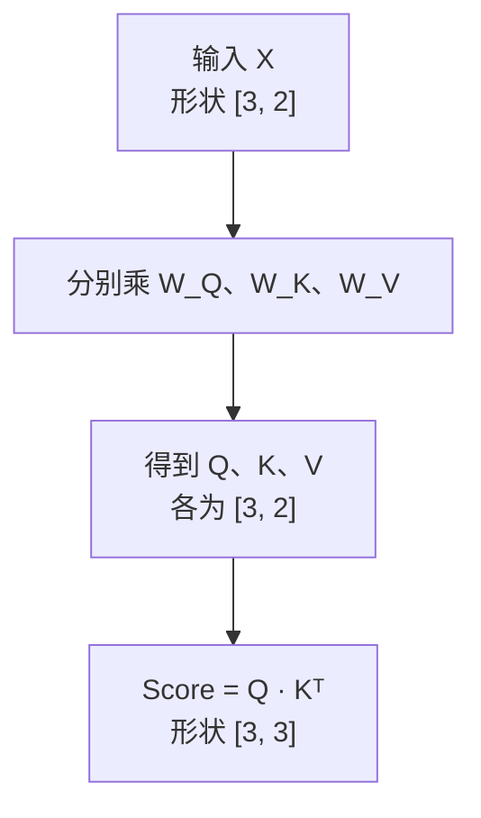
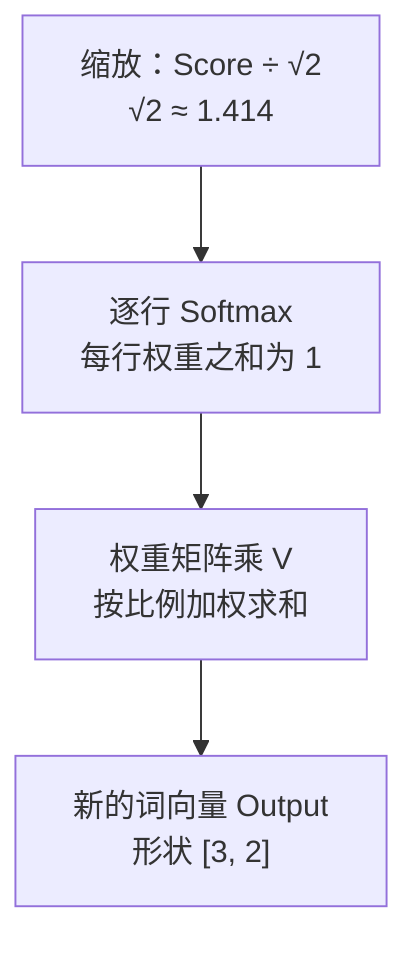

# 第3章：拆解注意力三剑客——Q、K、V 的生活大冒险与点积计算

> “在注意力的宇宙里，每一个词都拥有三副面孔：探寻者、被寻者与传道者。”

---

## 3.1 现实世界的绝妙类比：图书馆检索与购物搜索

在任何关于 Transformer 的文献中，你都会看到三个高频出现的英文字母：
- **$Q$**：Query（查询）
- **$K$**：Key（键 / 索引标签）
- **$V$**：Value（值 / 实际内容）

初学者往往会被这些数据库术语弄得一头雾水。别急，让我们来到日常生活中最熟悉的一个场景——**去图书馆借书**（或者在电商 App 里网购）：

| 角色 | 图书馆借书场景 | 注意力机制中的作用 |
| :--- | :--- | :--- |
| **Q（Query）** | 搜索词，例如“力学入门” | 当前词要寻找什么信息 |
| **K（Key）** | 书籍标签，例如“力学”“旅行摄影” | 候选词有哪些可供匹配的特征 |
| **V（Value）** | 书里的实际内容 | 候选词能提供的信息 |

当你拿着你的 **Query ($Q$)** 走向书架时：
1. 你会拿着 $Q$，去和每一本书的 **Key ($K$)** 挨个比对；
2. 如果书架标签写着“力学入门”，它和你的检索词高度匹配，**相关度得分（Score）极高（比如 95%）**；
3. 如果标签写着“旅行摄影”，匹配度极低，**得分几乎为 0%**；
4. 最后，你根据这些匹配得分，决定重点汲取哪本书的 **Value ($V$)**（把打分高的书里的知识装进脑海，打分低的书直接忽略）。

---

## 3.2 为什么同一个词需要“变身”为三种角色？

你可能会产生一个强烈的疑问：
> “一句话里的词，本来只有一个词向量 $X$。为什么非要把自己克隆并转换成 $Q$、$K$、$V$ 三个不同的向量呢？直接拿 $X$ 和 $X$ 算相似度不行吗？”

这是一个极其深刻的问题！让我们看一个人类社交的例子：

在班级交流中，一个人往往拥有三种截然不同的心理状态：
1. **提问状态 ($Q$)**：“我当前遇到了物理大题的困难，谁能帮帮我？”
2. **被检索状态 ($K$)**：“我的特长是数学和物理，如果有人想问理科题，可以来找我。”
3. **倾囊相授状态 ($V$)**：“既然你向我求助，我把我脑海里的解题步骤和思考逻辑讲给你听。”

如果**不加区分**，强行让 $Q = K = V = X$：
- 两个词向量点积 $\vec{x}_i \cdot \vec{x}_j$ 必然是对称的（$\vec{a} \cdot \vec{b} = \vec{b} \cdot \vec{a}$）；
- 这意味着“词 A 对 词 B 的关注度”将**被迫严格等于**“词 B 对 词 A 的关注度”！

但这在自然语言中是完全不合理的：
- 在句子“动词（吃）”和“名词（苹果）”中，“吃”非常迫切地需要寻找一个宾语作为承受者（“吃”对“苹果”的注意力应该极高）；
- 但“苹果”本身作为一个名词，它可能更关心修饰它的形容词“红色的”或代词“我的”，而不一定把所有重心都扑在“吃”上。

通过三个独立的线性变换矩阵 $W_Q, W_K, W_V$，每个词被赋予三副不同的面孔。论文里通常把词向量横着写成一行：
$$Q = X W_Q, \quad K = X W_K, \quad V = X W_V$$
配套代码把同一个向量竖过来，用“矩阵的每一行去点这个向量”。两种写法乘出来的数字相同，只是横竖不同。第 3.4 节会带你用手把 0.6 和 0.5 算一遍。

---

## 3.3 注意力计算五步法：逐步拆解公式

现在，让我们把那个价值千亿美金的经典注意力公式：
$$\text{Attention}(Q, K, V) = \text{Softmax}\left(\frac{Q K^T}{\sqrt{d_k}}\right) V$$
拆解成任何人都能看懂的 **五步基础算术运算**！


把计算链分成两张图：先做出“相关性分数”，再把分数变成“收集信息的比例”。两张图里的 Score 是同一张表。





### 表 3-1：为什么除以 $\sqrt{d_k}$？手写分数的 Softmax 对照

这些原始分数是为了方便用计算器核对而选的，不是某一次随机实验的输出。每一行三个百分比加起来都是 100%。

| 维度 $d_k$ | 标准差 $\sqrt{d_k}$ | 手写的原始分数 | **不除以 $\sqrt{d_k}$** | **除以 $\sqrt{d_k}$ 之后** |
| :---: | :---: | :---: | :--- | :--- |
| **2** | 1.41 | $[0.6,\ 1.0,\ 1.1]$ | 24.15%，36.03%，39.82% | 26.66%，35.37%，37.97% |
| **16** | 4 | $[4.2,\ -1.5,\ 8.9]$ | 0.90%，0.00%，**99.10%** | 22.33%，5.37%，**72.30%** |
| **64** | 8 | $[-8.6,\ -13.0,\ -4.3]$ | 1.34%，0.02%，**98.65%** | **30.41%，17.54%，52.05%** |
| **128** | 11.31 | $[15,\ -8,\ 26]$ | 0.00%，0.00%，**100%** | **26.49%，3.47%，70.04%** |

维度只有 2 时，除不除差别不大。维度到了 16 以上，不缩放的 Softmax 会把几乎全部注意力堆到一个数上。

想看真实随机向量，请运行 [code/03_scaled_dot_product.py](../code/03_scaled_dot_product.py)。随机种子固定为 42、维度为 64 时，三次点积大约是 $-8.57$、$-13.00$、$-4.31$。不缩放的权重是 1.39%、0.02%、98.59%；除以 8 之后变成 30.50%、17.54%、51.96%。现象和上表是同一类。

---

### Step 1：特征投影（线性变换）
将输入词向量 $X$（假设长度为 $d_{model}$）分别乘上三个可学习的权重矩阵 $W_Q, W_K, W_V$。
从几何上看，这类似于在二维平面上把一个坐标系进行拉伸和旋转，把原始的通用属性，换算成专门用于“提问”、“名片”和“内容”的新属性。

### Step 2：打分计算（向量点积）
计算词 $i$ 的查询向量 $Q_i$ 与词 $j$ 的键向量 $K_j$ 的点乘：
$$\text{RawScore}_{i, j} = Q_i \cdot K_j = \sum_{m=1}^{d_k} Q_{i, m} \times K_{j, m}$$
在向量长度固定时，方向越接近，点积越大；方向垂直时，点积为 0；夹角大于 90° 时，点积为负。

---

### Step 3：缩放因子——为什么神谕般地除以 $\sqrt{d_k}$？

为什么恰好除以 $\sqrt{d_k}$？下面从分数的波动幅度入手，用均值、方差和标准差推导这个缩放因子的由来。

> [!CAUTION]
> **方差爆炸危机与 Softmax 饱和**：
> 假设向量维度是 $d_k$（例如在真实大模型中 $d_k = 64$）。
> 这个推导用在**模型刚开始、数字还是随机的时候**：假设 $Q$ 和 $K$ 里的每一个数互不相关，均值是 0，方差是 1。训练以后数字会变，但“先除以 $\sqrt{d_k}$”这个习惯被保留了下来。
> 
> 这个推导会用到以下方差性质：
> 1. 如果变量 $X, Y$ 独立，均值为 0，方差为 1，那么乘积 $Z = X \cdot Y$ 的均值也是 0，方差 $\text{Var}(Z) = 1$；
> 2. 点乘是把 $d_k$ 个这样的乘积**加在一起**：
>    $$\text{Score} = \sum_{m=1}^{d_k} (Q_m \cdot K_m)$$
> 3. 根据方差的加法法则，相互独立的随机变量相加，方差也相加：
>    $$\text{Var}(\text{Score}) = 1 + 1 + \dots + 1 = d_k$$
> 4. 方差是 $d_k$，那么**标准差（波动幅度）**就是：
>    $$\sigma = \sqrt{d_k}$$

当 $d_k = 64$ 时，标准差高达 $\sqrt{64} = 8$！
这意味着计算出来的原始点积分数，经常会出现 $+24$ 甚至更大，或者 $-20$ 这样极端的数字。

接下来要送入 Softmax 计算：
$$\text{Softmax}(x_i) = \frac{e^{x_i}}{\sum e^{x_j}}$$
如果输入是 $[24, 0, -5]$：
- $e^{24} \approx 2.6 \times 10^{10}$
- $e^0 = 1$
- 最大的那个数占了总和的 **99.99999999%**，其他数字全变成 **0.00000000%**！

**可能带来的问题**：
这就像期末考试全班只有一个人考了 1000 分，其他人都是 0 分。函数会进入较平的饱和区，相关位置的梯度可能变小，学习变得困难。实际模型还要靠初始化、归一化和优化器等设计共同维持训练稳定。

**解药**：
把点积结果除以标准差 $\sqrt{d_k}$！
$$\frac{\text{Score}}{\sqrt{d_k}}$$
根据方差的缩放性质，把一个方差为 $d_k$ 的变量除以 $\sqrt{d_k}$，它的方差被稳稳地**拉回了 1**！分数温和健康，Softmax 能够平滑而公正地分配注意力！

---

### Step 4：Softmax 归一化（把分数换成百分比）

Softmax 可以分成三个步骤：
1. **第一步：消除负数**。取指数 $e^x$。因为对任何实数 $x$，$e^x$ 恒大于 0。
2. **第二步：全员加和**。求出全班的总分数之和。
3. **第三步：求占比**。每个人的 $e^x$ 除以总和。
结果是一组**非负、并且加起来等于 1.0 (100%)** 的权重；在有限精度下，极小的数可能显示成 0，经过掩码的位置则会被明确置为 0。

---

### Step 5：加权求和（吸收精华）

得到了每个词的注意力百分比权重 $A_{i, j}$ 之后，将它们分别乘上对应词的实际内容向量 $V_j$，然后加在一起：
$$\vec{v}_{\text{新}} = A_{i, 1} \cdot V_1 + A_{i, 2} \cdot V_2 + \dots + A_{i, N} \cdot V_N$$
就像按配方调配一杯鸡尾酒：30% 的伏特加 + 50% 的橙汁 + 20% 的柠檬糖浆，最终调制出一杯风味独特的特调饮品！

---

## 3.4 纯 Python 纯手工算一遍代码精讲

现在，让我们拿出草稿纸，阅读 [code/02_manual_attention.py](../code/02_manual_attention.py)。

假设句子只有 3 个词：“我”、“爱”、“学”。我们设定词向量维度为 2。权重矩阵是手写的，不是训练出来的。以“我”$=[1.0,\ 0.5]$ 为例，查询向量的两个数是：

$$
\begin{aligned}
Q_0 &= 0.5 \times 1.0 + 0.2 \times 0.5 = 0.6 \\
Q_1 &= 0.1 \times 1.0 + 0.8 \times 0.5 = 0.5
\end{aligned}
$$

请先在草稿纸上算出这两个数，再对照程序打印的 `Q=[0.600, 0.500]`。

```python
words = ["我", "爱", "学"]
x = [
    [1.0, 0.5],  # “我”
    [0.8, 1.2],  # “爱”
    [0.2, 1.5]   # “学”
]
```

代码通过矩阵乘以向量得到每一个词的 Q, K, V：
```text
词 '我': Q=[0.600, 0.500], K=[0.550, 0.550], V=[1.050, 0.450]
词 '爱': Q=[0.640, 1.040], K=[0.680, 1.000], V=[0.920, 1.080]
词 '学': Q=[0.400, 1.220], K=[0.530, 1.090], V=[0.350, 1.350]
```

接着进行点乘并除以 $\sqrt{2} \approx 1.414$：
```text
打分矩阵 (未归一化):
              目标:我        目标:爱        目标:学
查询:我       0.4278      0.6421      0.6102
查询:爱       0.6534      1.0431      1.0414
查询:学       0.6300      1.0550      1.0902
```

经过 Softmax 转换为百分比：
```text
注意力权重矩阵 (Attention Weights %):
              目标:我        目标:爱        目标:学
查询:我       29.08%      36.03%      34.90%
查询:爱       25.31%      37.38%      37.31%
查询:学       24.31%      37.18%      38.51%
```

最后进行加权平均，计算出全新的“我”：
- 吸收自身“我”的 $V$ 的 29.08%
- 吸收“爱”的 $V$ 的 36.03%
- 吸收“学”的 $V$ 的 34.90%
- **合成出的新“我” = $[0.7589, 0.9910]$**

这一行行加减乘除，就是注意力里最基本的计算单元。矩阵是手写的，所以这次还不能叫“模型读懂了这句话”，只能叫“混合手续已经走通”。

---

## 3.5 本章小结

- **Q、K、V** 是同一个词的三种角色映射：Q 是搜索词，K 是标签，V 是内容。
- **点积**用来度量向量夹角与相关性。
- **除以 $\sqrt{d_k}$** 是为了抵消高维方差累加效应，防止 Softmax 梯度饱和。
- **Softmax** 将分数转化为和为 100% 的概率权重。
- **加权求和**将所有相关词的 Value 汇聚成融合上下文的全新表示。

但是，如果只用一套 Q、K、V，就像一个人只有一双眼睛，只能从一个固定的角度看世界。
能不能像神话里的二郎神或者哪吒一样，拥有“三头六臂”，同时从多个维度审视一句话呢？
请看下一章：**多头注意力（Multi-Head Attention）**！
