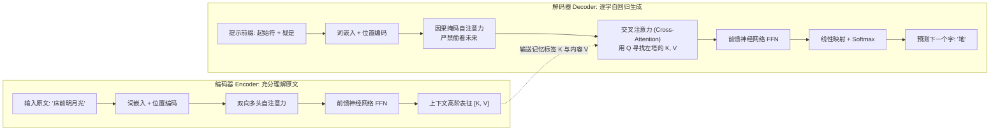
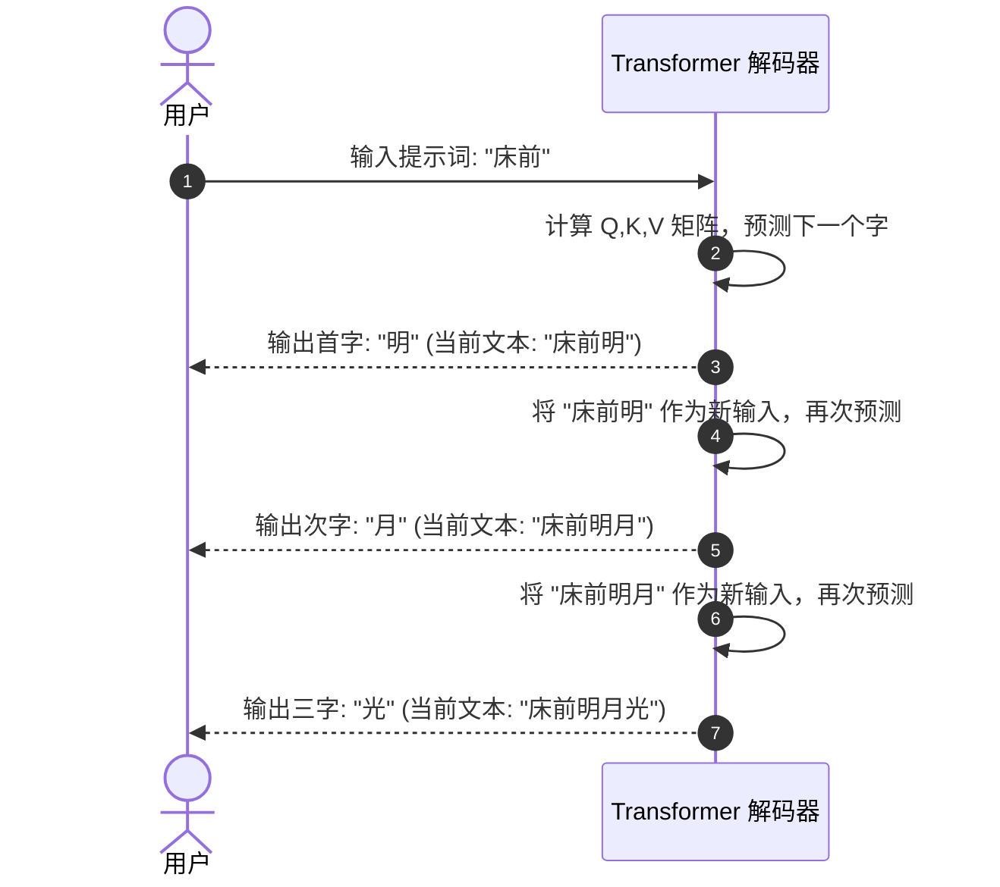

# 第7章：编码器与解码器——从文本理解到自回归生成

> “一个负责深谋远虑地洞察全文，一个负责字斟句酌地构想未来。”

---

## 7.1 双雄对决：编码器（Encoder）与解码器（Decoder）

在经典的 Transformer 论文《Attention Is All You Need》中，模型被设计成一个由两座巨塔并立组成的庞大系统：
- **左塔：编码器（Encoder）**
- **右塔：解码器（Decoder）**

它们各自扮演什么角色？请看下表的全方位深度对比：

### 表 7-1：编码器 vs 解码器核心特性全景对比表

| 维度 | 编码器 (Encoder) | 解码器 (Decoder) |
| :--- | :--- | :--- |
| **形象比喻** | **试卷阅卷老师**（全面通读整篇文章） | **高考考场作家**（逐字构思写作文） |
| **核心使命** | **文本理解与特征提取** | **文本生成与自回归续写** |
| **注意力机制** | **双向自由自注意力**（每个词能看前后所有词） | **因果掩码注意力**（只能看自己和之前的词） |
| **是否有掩码** | 无因果掩码（全员 100% 畅通互联） | **严格施加下三角因果掩码**（严禁偷看未来） |
| **交叉注意力** | 无（只关心输入句子内部的交互） | **有 Cross-Attention**（作为桥梁汲取编码器知识） |
| **输入方式** | 一次性整句打包输入（全部词瞬间并行） | 生成时逐步自回归输入（生成一个词，塞回输入一个词） |
| **典型代表模型** | BERT、RoBERTa（擅长做分类、情感判断） | **GPT 系列、LLaMA、DeepSeek**（擅长对话聊天、写代码） |
| **双塔结合代表** | 经典机器翻译 Transformer、Google T5、BART | - |

---

## 7.2 宏观架构流程图

让我们通过宏观架构图，直观审视这两座巨塔是如何默契联动的：




---

## 7.3 为什么解码器必须施加“因果掩码（Causal Mask）”？

许多初学者在自学大模型时都会问：
> “既然自注意力能让所有词互相交流，为什么解码器非要把未来的词遮挡住？这不是自废武功吗？”

### 闭卷考试与作弊警示

想象一下，如果在语文考试中，老师让你做“名句默写”：
- 题目写着：“春眠不觉晓，处处闻啼鸟。夜来风雨声，花落知______。”
- 如果在考试过程中，系统允许你**直接转头看向句末的‘少’字**；
- 那么在计算注意力时，空缺处的词向量就会直接拿‘少’字的特征交差！
- **后果**：模型在训练阶段“抄近道作弊”，一旦到了没有参考答案的真实应用场景中，它连一个字都生不出来！

为了杜绝这种“未来信息泄露”，解码器引入了 **因果掩码（Causal Mask / 下三角掩码）**！


### 表 7-2：4 词序列的掩码矩阵数值演变推导表

假设输入序列为四个字：“我”、“爱”、“学”、“习”。

#### 1. 原始点积分数矩阵 (Q · K^T / √d_k)：
| 查询 (Query) \ 键 (Key) | 词1(我) | 词2(爱) | 词3(学) | 词4(习) |
| :--- | :---: | :---: | :---: | :---: |
| **词1(我)** | 2.15 | **1.80 (未来!)** | **0.95 (未来!)** | **0.40 (未来!)** |
| **词2(爱)** | 1.30 | 3.20 | **2.10 (未来!)** | **1.05 (未来!)** |
| **词3(学)** | 0.85 | 1.95 | 2.80 | **1.70 (未来!)** |
| **词4(习)** | 0.40 | 1.10 | 2.30 | 3.10 |

#### 2. 施加因果掩码后（未来位置强制填入 -1e9）：
| 查询 (Query) \ 键 (Key) | 词1(我) | 词2(爱) | 词3(学) | 词4(习) |
| :--- | :---: | :---: | :---: | :---: |
| **词1(我)** | 2.15 | $-\infty$ | $-\infty$ | $-\infty$ |
| **词2(爱)** | 1.30 | 3.20 | $-\infty$ | $-\infty$ |
| **词3(学)** | 0.85 | 1.95 | 2.80 | $-\infty$ |
| **词4(习)** | 0.40 | 1.10 | 2.30 | 3.10 |

#### 3. 最终 Softmax 注意力权重矩阵（百分比）：
| 查询 (Query) \ 键 (Key) | 词1(我) | 词2(爱) | 词3(学) | 词4(习) | 每行总和 |
| :--- | :---: | :---: | :---: | :---: | :---: |
| **词1(我)** | **100.0%** | **0.0%** | **0.0%** | **0.0%** | 100.0% |
| **词2(爱)** | **13.01%** | **86.99%** | **0.0%** | **0.0%** | 100.0% |
| **词3(学)** | **9.06%** | **27.23%** | **63.71%** | **0.0%** | 100.0% |
| **词4(习)** | **4.07%** | **8.19%** | **27.20%** | **60.54%** | 100.0% |

> [!NOTE]
> **用第 2 行把手算走一遍**：
> 允许看见的分数是 1.30 和 3.20。
> $e^{1.30} \approx 3.67$，$e^{3.20} \approx 24.53$，加起来约 28.20。
> 权重分别是 $3.67/28.20 \approx 13.01\%$ 和 $86.99\%$。
> 被写成 $-\infty$ 的格子贡献 $e^{-\infty} = 0$，所以未来的字不会分到百分比。
> 第 3、4 行用的是同一套算法。上面的原始分数是为了演示而写的，不是某个训练好的模型量出来的。

---

## 7.4 交叉注意力（Cross-Attention）：解码器与编码器的秘密对话

在双塔架构中，解码器不仅要审视自己已经写出的字，更要时刻对照编码器送过来的“原文参考资料”。
负责打通两座巨塔的枢纽，就是 **交叉注意力（Cross-Attention）**！

### Q、K、V 的跨界组装法则：
回忆我们在第 3 章学过的图书检索类比：
- **谁在发问？（Query 来自哪里？）**
  解码器正在写译文，它心里最清楚当前写到哪儿了、卡在哪个词上。因此：
  $$\mathbf{Q \ 来自 \ 解码器自身（Decoder）}$$
- **上哪儿去查参考答案？（Key 和 Value 来自哪里？）**
  原文的所有背景知识都在编码器肚子里。因此：
  $$\mathbf{K, V \ 来自 \ 编码器的最终输出（Encoder）}$$

```
   解码器 (Decoder) ──生成提问──► Q: "我接下来要翻译宾语了，原文的宾语是什么？"
                                  │
                                  ▼ (点积比对)
   编码器 (Encoder) ──提供标签──► K: ["主语:张三", "谓语:吃", "宾语:红富士苹果"]
                    ──提供实质──► V: [张三的特征, 吃的特征, 苹果的特征]
                                  │
                                  ▼ (加权提炼)
   解码器获得精准上下文 ───────► "抓取到了！宾语是'苹果'，英文应该输出 'apple'！"
```

这种机制让译文在生成时可以反复查询原文表示，通常比只依赖解码器自己的历史更容易保持与原文的对应；最终效果仍取决于训练数据和模型能力。

---

## 7.5 自回归生成机制（Autoregressive Decoding）：贪吃蛇的自循环

现在，我们来看 ChatGPT 和各种大模型在聊天时，那个“一闪一闪逐字打印”的打字机特效到底是怎么实现的。

这种生成方式叫做 **自回归（Autoregressive）**。
它的运行模式就像一盘**“贪吃蛇游戏”**：蛇每吃掉一颗豆子（生成一个新词），蛇的身体就变长一节，然后整条变长的蛇又作为新的输入，去寻找下一颗豆子！



### 表 7-3：自回归生成每一步的数据流追踪表

| 步数 (Step) | 模型输入序列 (Input Sequence) | 预测下一个字的候选概率分布 (Top-3) | 采样选中的新字 | 拼接后的新序列 |
| :---: | :--- | :--- | :---: | :--- |
| **第 1 步** | `["床", "前"]` | 明: 92%, 地: 5%, 月: 3% | **明** | `["床", "前", "明"]` |
| **第 2 步** | `["床", "前", "明"]` | 月: 96%, 日: 2%, 星: 2% | **月** | `["床", "前", "明", "月"]` |
| **第 3 步** | `["床", "前", "明", "月"]` | 光: 98%, 照: 1%, 亮: 1% | **光** | `["床", "前", "明", "月", "光"]` |
| **第 4 步** | `["床", "前", "明", "月", "光"]` | ，: 99%, 。: 1% | **，** | `["床", "前", "明", "月", "光", "，"]` |

当模型预测出特殊的终止符（如 `<EOS>`，End of Sequence）或达到最大字数限制时，循环停止，一次流畅的人机对话就此圆满结束！

---

## 7.6 本章小结

- **编码器**拥有无拘无束的双向视界，专精于全文深刻理解；
- **解码器**受制于因果掩码，只能向左看，专精于自回归续写；
- **交叉注意力**让解码器用自己的 $Q$ 去匹配编码器的 $K$ 和 $V$，搭建起跨语言、跨模态的理解之桥；
- **自回归生成**通过“预测新词 -> 塞回输入 -> 预测下一个词”的贪吃蛇循环，实现了大模型灵动自然的创作输出。

现在，理论的拼图已经全部集齐！
在下一章中，我们将不再空谈理论，而是**手把手从第一行代码开始，亲自训练一个可以吟诵古诗的微型大模型（Baby-GPT）**！
