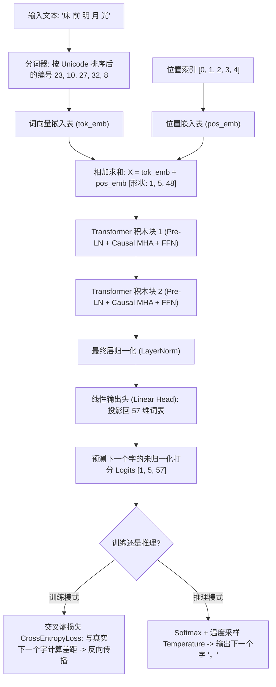

# 第8章：实战——手搭一个微型大语言模型（Baby-GPT）

> “纸上得来终觉浅，绝知此事要躬行。没有什么比亲眼看着一行行代码从乱码训练到出口成章更令人震撼的了。”

---

## 8.1 我们的任务目标：诗词小才子 Baby-GPT

在本章中，我们将抛开一切复杂的工业级封装，从第一行代码开始，亲手搭建一个真正的、完整的自回归大语言模型——**Baby-GPT**！

我们让它学习李白《静夜思》、王之涣《登鹳雀楼》和孟浩然《春晓》。三首诗分开喂，不粘成一条。
训练前，给它“床前”，它会吐出乱码。训练 80 轮后，损失会降到接近 0，三个课文开头都能接回去。再给一个不是开头的“明月”，它就接错。请把这个限度一起看完。

---

## 8.2 模型超参数与配置规格表

为了让这个实验在普通笔记本的 CPU 上也能较快跑完，我们把数据和模型都控制得很小。实际耗时会随电脑、PyTorch 版本和线程数变化，不把“2 秒”当成硬性承诺：

### 表 8-1：Baby-GPT 架构超参数规格表

| 超参数名称 | 变量名 | 数值 | 通俗初学者解释 |
| :--- | :--- | :---: | :--- |
| **字符词表大小** | `vocab_size` | **57** | 训练诗句中所有出现过的不同汉字与标点总数 |
| **词向量特征维度** | `d_model` | **48** | 每个汉字用 48 个特征数字（坐标）来描述 |
| **注意力头数** | `num_heads` | **4** | 分成 4 个专家小分队，每个分队维度为 $48/4 = 12$ |
| **积木块层数** | `num_layers` | **2** | 堆叠 2 层 Pre-LN Transformer Block |
| **最大上下文窗口** | `max_seq_len` | **128** | 模型单次能够阅读和记忆的最长汉字数 |
| **学习率** | `learning_rate` | **0.01** | 每次梯度下山微调参数的步伐大小 |
| **总参数量** | `Parameters` | **67872** | 运行脚本时会打印这个整数。聊天模型的参数量比它大很多个数量级，GPT-4 的准确数字官方没有公布 |

---

## 8.3 数据流与模型前向传播全景图

下图清晰展示了一个汉字序列从输入、穿过积木块、直到预测下一个字的全部旅程：



---

## 8.4 完整源代码深度精讲（保姆级逐行拆解）

让我们逐段拆解配套脚本 [code/07_baby_gpt.py](../code/07_baby_gpt.py)。

### 1. 词表与分词器（Tokenizer）

```python
# 训练语料：三首经典唐诗
text_corpus = (
    "床前明月光，疑是地上霜。举头望明月，低头思故乡。"
    "白日依山尽，黄河入海流。欲穷千里目，更上一层楼。"
    "春眠不觉晓，处处闻啼鸟。夜来风雨声，花落知多少。"
)

# 提取不重复汉字构建字典
unique_chars = sorted(list(set(text_corpus)))
vocab_size = len(unique_chars)  # 57 个字符
char2idx = {ch: i for i, ch in enumerate(unique_chars)}
idx2char = {i: ch for i, ch in enumerate(unique_chars)}
```

#### 表 8-2：部分汉字与数字 ID（运行脚本时的真实编号）

`sorted` 按 Unicode 编码排序。句号“。”排在汉字前面，全角逗号“，”排在汉字后面。这些编号只是座位号，没有“逗号比霜更大”这种含义。

| 汉字 | 数字 ID | 汉字 | 数字 ID | 汉字 | 数字 ID |
| :---: | :---: | :---: | :---: | :---: | :---: |
| **。** | 0 | **一** | 1 | **上** | 2 |
| **不** | 3 | **光** | 8 | **前** | 10 |
| **地** | 13 | **床** | 23 | **明** | 27 |
| **月** | 32 | **霜** | 52 | **，** | 56 |

所以“床前明月光”五个字的编号是 23、10、27、32、8。请用脚本打印核对，不要凭感觉给汉字编号。

---

### 2. 因果自注意力模块（CausalSelfAttention）

这是模型的“灵魂中枢”，注意看我们是如何将因果掩码注册进 PyTorch 缓冲区的：

```python
class CausalSelfAttention(nn.Module):
    def __init__(self, d_model, num_heads, max_seq_len):
        super().__init__()
        self.num_heads = num_heads
        self.head_dim = d_model // num_heads

        # 线性投影层
        self.W_q = nn.Linear(d_model, d_model, bias=False)
        self.W_k = nn.Linear(d_model, d_model, bias=False)
        self.W_v = nn.Linear(d_model, d_model, bias=False)
        self.W_o = nn.Linear(d_model, d_model, bias=False)

        # 核心：下三角掩码缓冲区（不需要计算梯度）
        mask = torch.tril(torch.ones(max_seq_len, max_seq_len))
        self.register_buffer("mask", mask)

    def forward(self, x):
        B, T, C = x.shape  # Batch(批次), Time(序列长度), Channel(维度)

        # 投影并切分多头: [B, num_heads, T, head_dim]
        Q = self.W_q(x).view(B, T, self.num_heads, self.head_dim).transpose(1, 2)
        K = self.W_k(x).view(B, T, self.num_heads, self.head_dim).transpose(1, 2)
        V = self.W_v(x).view(B, T, self.num_heads, self.head_dim).transpose(1, 2)

        # 点乘打分并缩放
        scores = torch.matmul(Q, K.transpose(-2, -1)) / math.sqrt(self.head_dim)
        
        # 施加掩码：将右上角未来位置填入 -1e9 (-∞)
        scores = scores.masked_fill(self.mask[:T, :T] == 0, -1e9)
        
        # Softmax 归一化
        weights = F.softmax(scores, dim=-1)
        
        # 加权求和并拼回原状
        out = torch.matmul(weights, V).transpose(1, 2).contiguous().view(B, T, C)
        return self.W_o(out)
```

---

### 3. 完整的 BabyGPT 模型组装

```python
class BabyGPT(nn.Module):
    def __init__(self, vocab_size, d_model=48, num_heads=4, num_layers=2, max_seq_len=128):
        super().__init__()
        self.max_seq_len = max_seq_len
        # 词嵌入，以及可学习的座位表。
        # 这不是第 5 章的 sin/cos。每个座位一行向量，数字在训练中自己学。
        self.tok_emb = nn.Embedding(vocab_size, d_model)
        self.pos_emb = nn.Embedding(max_seq_len, d_model)
        
        # 堆叠 2 层积木块
        self.blocks = nn.ModuleList([
            BabyBlock(d_model, num_heads, max_seq_len) for _ in range(num_layers)
        ])
        
        # 输出头
        self.ln_f = nn.LayerNorm(d_model)
        self.head = nn.Linear(d_model, vocab_size, bias=False)

    def forward(self, idx, targets=None):
        B, T = idx.shape
        pos = torch.arange(0, T, dtype=torch.long, device=idx.device)

        # 融合词义与位置
        x = self.tok_emb(idx) + self.pos_emb(pos)

        for block in self.blocks:
            x = block(x)

        x = self.ln_f(x)
        logits = self.head(x)  # [B, T, vocab_size]

        loss = None
        if targets is not None:
            # 高中概率交叉熵：衡量预测分布与真实字的差距
            loss = F.cross_entropy(logits.view(-1, logits.size(-1)), targets.view(-1))

        return logits, loss
```

训练循环不要把三首诗粘成一条。每一首单独算一次“猜下一个字”的损失，再取平均：

```python
encoded_poems = [torch.tensor(encode(poem), dtype=torch.long) for poem in poems]
losses = []
for data in encoded_poems:
    _, loss = model(data[:-1].unsqueeze(0), data[1:].unsqueeze(0))
    losses.append(loss)
loss = torch.stack(losses).mean()
```

`data[:-1]` 是输入，`data[1:]` 是紧挨着的下一个字。例如“床前明”，输入是“床前”，目标是“前明”。

---

## 8.5 训练过程与 Loss 下降实验数据表

运行训练后，模型在 80 个步长内展现出了惊人的学习速度：

三首诗**分开**训练，每首都从座位 0 开始，损失取三次的平均。随机种子是 42。如果把三首诗粘成一条，模型会只记住“第 i 个座位的下一个字”；这时提示“白日”仍会被放到第 0 号座位，于是接着背《静夜思》。

前馈网络用的是 GELU。它在 0 附近是一条平滑曲线。第 6 章的小演示用的是 ReLU，两种都能把积木跑通。

### 表 8-3：种子 42、三首诗分开训练时的损失

完全瞎猜下一个字时，损失大约是 $-\ln(1/57) = \ln 57 \approx 4.04$。第 1 轮测到的 4.1271 和这个数很接近。

| 训练轮次 | 损失值 | 这时实际发生了什么 |
| :---: | :---: | :--- |
| **第 1 轮** | **4.1271** | 接近盲目乱猜 |
| **第 20 轮** | **0.0196** | 三首课文的下一个字已经大体背出来 |
| **第 40 轮** | **0.0021** | 仍在把同一份课文背得更死 |
| **第 60 轮** | **0.0011** | 训练损失继续变小 |
| **第 80 轮** | **0.0009** | 对这三首诗的下一个字几乎没有误差 |

损失接近 0，是因为课文只有 72 个字，67872 个参数足够把它记住。这不是学会了作诗。

---

## 8.6 见证奇迹：真实生成效果对比

让我们看看训练前后的生成效果对比：

下表用的是贪心解码：每一步都选当前分数最高的字，所以种子 42 下每次运行都是这几句。温度大于 0 时会掷骰子，句子可能变化。

### 表 8-4：训练前后的贪心续写（每次再生成 15 个字）

| 输入提示 | 未训练 | 训练 80 轮后 |
| :--- | :--- | :--- |
| **床前** | `床前穷河前月眠欲黄头黄一日依疑，床` | `床前明月光，疑是地上霜。举头望明月` |
| **白日** | `白日穷河前月眠欲黄头黄一日依疑，床` | `白日依山尽，黄河入海流。欲穷千里目` |
| **春眠** | `春眠落头黄风白望入落欲一日依疑，床` | `春眠不觉晓，处处闻啼鸟。夜来风雨声` |

三个课文开头都能接回去。再试一个课文里有、但不是开头的提示：

`明月` → `明月不觉晓，处处闻啼鸟。夜来风雨声`

它没有接成“明月**光，疑是地上霜**”，而是滑进了《春晓》。小模型记住的是三首短课文的开头，不是“月光”这个意思。

> [!TIP]
> **关于采样温度（Temperature）的数学直觉**：
> 在生成代码中，有一行：
> `logits = logits / temperature`
> - 当 `temperature = 1.0` 时：保持原有概率；
> - 当 `temperature = 0.2` 时：所有得分被除以 0.2（相当于放大 5 倍！）。经过 Softmax 后，概率会更偏向当前最高分的字，模型通常更**保守、集中**，但不保证达到 100%；
> - 当 `temperature = 2.0` 时：分数差距被缩小，概率会更平均，模型通常更**随机**，也更容易生成训练语料里没有出现过的组合。

---

## 8.7 本章小结

在本章中，我们从 0 到 1：
1. 制作了一个字符级分词器；
2. 搭建了带因果掩码的多头自注意力层与完整的 Transformer 积木块；
3. 编写了训练循环与自回归生成函数；
4. 看到损失从 $4.13$ 降到 $0.0009$，以及这种下降的限度：三首诗的开头被背下来了，没学过的提示不会。

到这里，主干计算已经能亲手走通。
然而，真实世界中的 ChatGPT、Claude、DeepSeek 拥有上千亿参数，它们在此基础上又进化出了哪些现代武器？
请看最后一章：**走向未来——从经典 Transformer 到 GPT-4、DeepSeek**！
