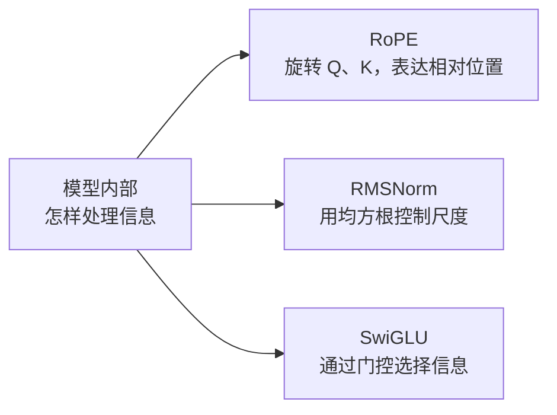
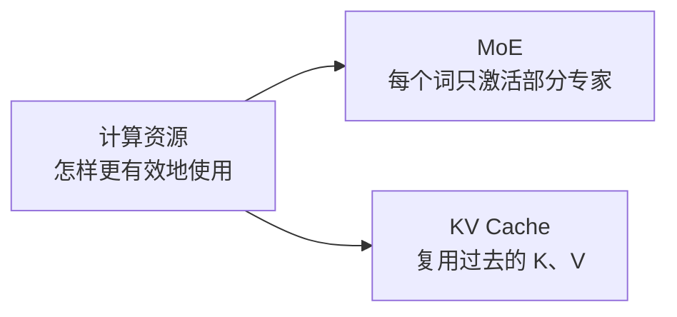

# 第9章：走向未来——从经典 Transformer 到 GPT-4、DeepSeek

> “科学不是一座静止的神庙，而是一条永不停息奔涌向前的大河。”

---

## 9.1 架构选择：为什么开放式生成常用 Decoder-Only？

在 2017 到 2020 年间，深度学习界曾有过激烈的“流派之争”：
- **Encoder-Only 派**：以 Google 的 **BERT** 为代表，专精于理解和分类；
- **Encoder-Decoder 派**：以 Google 的 **T5** 为代表，专精于机器翻译和摘要；
- **Decoder-Only 派**：以 OpenAI 的 **GPT 系列** 为代表，坚持纯自回归生成。

到了近几年的开放式聊天模型中，GPT、LLaMA、DeepSeek 等许多代表性系统采用 **Decoder-Only（仅解码器）**。这是适合“读完前文，继续预测下一个词”的工程选择，并不表示 Encoder-Only 或 Encoder-Decoder 已经没有用途。

### 三种架构各自擅长什么？

### 表 9-1：三大 Transformer 派系历史战役复盘表

| 架构流派 | 典型代表 | 训练任务 | 为什么被淘汰 / 为什么胜出？ |
| :--- | :--- | :--- | :--- |
| **Encoder-Only** | BERT、RoBERTa | 掩码填空、表示学习 | 很适合分类、检索和抽取；它不是为逐字生成而设计的，但经过改造也可以参与生成任务。 |
| **Encoder-Decoder** | T5、BART | 输入一段文本，再生成另一段文本 | 很适合翻译、摘要等“输入到输出”的转换任务，代价是需要维护两座互相配合的模块。 |
| **Decoder-Only** | GPT、LLaMA、DeepSeek | **预测下一个词 (Next-Token)** | 训练目标和开放式续写天然一致，结构简单，适合把同一个模型扩展到聊天、代码和长文本生成。 |

---

## 9.2 现代大模型的五种关键改进：原理与直觉

从我们刚才手搓的 Baby-GPT，到今天掌控世界算力的千亿大模型，工业界在以下 5 个关键构件上进行了脱胎换骨的升级：

下面按用途把五种改进分成两张图。图中只概括它们的作用，实际收益还取决于模型、训练数据和硬件。





例如，Mixtral 8×7B 在 8 个专家中选择 2 个；DeepSeek-V3 在 256 个路由专家中选择 8 个，并另有共享专家。RoPE 并不自动保证任意长度的外推，KV Cache 的加速倍数也不是固定常数。

---

### 杀手锏 1：旋转位置编码（RoPE）——复数平面上的几何旋转

在第 5 章中，我们学习了绝对正弦位置编码。但在处理长达 10 万字甚至 100 万字的长文本时，原版正弦编码的外推能力有限。

研究者苏剑林等人在 2021 年的论文 RoFormer 里提出了 **RoPE（Rotary Position Embedding，旋转位置编码）**。后来的 LLaMA、DeepSeek 都广泛使用它。

> [!NOTE]
> **用旋转矩阵，而不是和差化积**：
> 把二维向量 $(x, y)$ 旋转角度 $\theta$，就是乘下面这个矩阵：
> $$\begin{pmatrix} x' \\ y' \end{pmatrix} = \begin{pmatrix} \cos\theta & -\sin\theta \\ \sin\theta & \cos\theta \end{pmatrix} \begin{pmatrix} x \\ y \end{pmatrix}$$
> 
> **RoPE 在做什么**：
> - 第 $m$ 个座位上的 Query，旋转 $m\theta$；
> - 第 $n$ 个座位上的 Key，旋转 $n\theta$；
> - 做点积时，其中一个旋转可以先转回去。净效果只剩下相对角度 $(n-m)\theta$。
> 
> 绝对座位被消掉了，剩下两个字隔了多远。

---

### 杀手锏 2：RMSNorm——先不管平均数，只控制振幅

在第 6 章中，经典的 LayerNorm 需要先算平均数 $\mu$，再算方差 $\sigma^2$。

研究人员发现：让数据中心保持零均值其实没那么重要，真正起到稳定数值作用的，是**控制向量的整体振幅大小**！
于是，**RMSNorm（均方根归一化）** 应运而生：
$$\text{RMS}(x) = \sqrt{\frac{1}{d} \sum_{i=1}^d x_i^2}$$
$$\text{RMSNorm}(x) = \frac{x}{\text{RMS}(x)} \odot \gamma$$

它直接省去了计算均值的一整套步骤，将显存访问和计算时间压缩了 10% 到 50%，成为了现代模型的标配！

---

### 杀手锏 3：SwiGLU 激活函数——带有开关的神经元

传统模型使用 ReLU（只保留正数）。现代模型普遍换用了 **SwiGLU**。
它的直觉就像在电路中加了一个**“可调节亮度的电位器开关”**：
$$\text{SwiGLU}(x) = \big(\text{Swish}(x W_{\text{门}}) \odot (x W_{\text{上}})\big) W_{\text{下}}$$
这里的 $\odot$ 是两个向量**对应位置相乘**，不是点积，最后再乘输出矩阵。一条路准备内容，另一条路当开关：开关开多大，内容就通过多少。

---

### 杀手锏 4：混合专家架构（MoE）——DeepSeek 的低成本核武器

如果一个模型拥有 6710 亿总参数（例如 [DeepSeek-V3 技术报告](https://arxiv.org/abs/2412.19437)中的模型），每次回答一个字都让全部参数跑一遍，电费和硬件成本会非常高。MoE 的想法是：每个词只路由到少数专家。

DeepSeek 和 Mixtral 采用的 **MoE（Mixture of Experts，混合专家模型）** 改变了游戏规则：

```
                    输入当前词
                        │
                        ▼
               [ 路由器 Router ]
                        │
         ┌──────────────┴──────────────┐
         ▼ 本次参加                       ▼ 本次休眠
   DeepSeek-V3：叫醒 8 个路由专家     其余约 248 个路由专家不参加
   另外还有 1 个共享专家，每次都参加
         │
         ▼
   整个模型约 6710 亿参数
   每个词激活的大约是 370 亿参数
```

两套常见数字不要混在一起：
- **Mixtral**：一共 8 个专家，每个词叫醒其中 2 个。
- **DeepSeek-V3（技术报告中的版本）**：每层有 256 个路由专家，每个词选择其中 8 个，并配合共享专家；报告给出的总参数约 6710 亿、每个词激活约 370 亿。模型版本会更新，数字应以对应技术报告为准。

专家不是出厂就贴着“数学”“历史”的标签。路由器学的是“这个词更适合交给哪几个专家”，分工是训练出来的。

---

### 杀手锏 5：KV Cache 机制——消除重复运算的打字机

在自回归生成时，如果没有 KV Cache，生成每个新词都可能重新计算整段前缀的 $Q,K,V$ 和注意力。对长度为 $t$ 的这一步，注意力本身大约要处理 $t^2$ 个位置对；把每一步累加到长度 $N$，朴素实现的总工作量会接近 $O(N^3)$。

**KV Cache 的秘密**：
过去已经生成的词，在固定的上下文和模型参数下，它们的 **Key 和 Value 不需要重复计算**。模型把之前算好的 K 和 V 存在缓存里。每次生成新词时，只计算当前词的 Query，再与缓存中的历史 K、V 做一次注意力；长度为 $t$ 的单步工作量约为 $O(t)$，生成到长度 $N$ 的总注意力工作量约为 $O(N^2)$。KV Cache 消除的是重复计算，不会把长文本注意力变成常数时间。

---

## 9.3 顶级大模型架构进化对照表

下表汇总了自 2017 年以来最具代表性的大模型架构演进轨迹：

### 表 9-2：从经典 Transformer 到 DeepSeek 的参数与架构进化演变

| 特性 / 模型 | 经典 Transformer (2017) | GPT-2 (2019) | LLaMA 3 (2024) | DeepSeek-V3 (2024) |
| :--- | :---: | :---: | :---: | :---: |
| **基础架构** | Encoder-Decoder | Decoder-Only | Decoder-Only | **Decoder-Only (MoE)** |
| **归一化位置** | Post-LN (后置) | Pre-LN (前置) | Pre-LN (前置) | **RMSNorm (无均值)** |
| **位置编码** | 绝对正弦余弦 | 可学习绝对位置 | **RoPE (旋转位置)** | **RoPE (带多级扩展)** |
| **激活函数** | ReLU | GELU | **SwiGLU** | **SwiGLU** |
| **注意力机制** | 标准 MHA | 标准 MHA | **GQA (分组查询注意力)** | **MLA (多头潜在注意力)** |
| **专家机制** | 单体 Dense | 单体 Dense | 单体 Dense | **MoE (256 专家激活 8 个)** |
| **最大上下文** | 常见实现约 512 | 1024 | 8,192；后续 3.1 可到 128K | **128,000（128K）** |

---

## 9.4 尺度定律（Scaling Law）与神奇的“涌现现象”

最后，让我们回答一个终极哲学问题：
> “大模型到底为什么会产生像人类一样的推理、翻译和解题能力？”

2020 年，OpenAI 发现了震惊学术界的 **尺度定律（Scaling Law）**：
在不少受控实验中，随着**模型参数量（Model Size）**、**训练数据量（Dataset Size）** 和 **计算算力（Compute）** 一起增加，预测误差（Loss）会近似沿幂律下降；真实训练还会受到数据质量、优化方法和评测方式影响。

有人把某些能力在变大之后才明显表现出来，叫做**涌现**。这个说法要小心用：不同任务的转折点不一样；有的“突然变好”是因为评分只有对和错，中间的进步被尺子藏住了。更稳妥的观察是：参数、数据和算力一起变大时，预测下一个词的损失沿一条比较平滑的曲线下降。下面的图只表示“规模变大以后，有些困难任务开始做得动”，不是说跨过某一天就会自动会解物理竞赛。

```
预测下一个词的损失 ▲ 越高越差
         │ \
         │  \   小模型：损失高，困难任务经常做不动
         │   \
         │    \________  规模、数据、算力一起变大，损失大体平滑下降
         └────────────────────────────────► 规模
```

有些困难任务要到模型比较大时才开始做得动。这仍然是“预测下一个词”训练出来的结果，不是模型自动获得了一套和人类相同的心智。第 8 章那个只背三首诗的小模型，就是尺度还很小的时候。

---

## 9.5 本章小结

- **Decoder-Only** 因为训练目标和开放式续写很贴合，成为近年聊天与代码模型中的主流选择；
- **RoPE、RMSNorm、SwiGLU、MoE 与 KV Cache** 是现代顶级大模型兼顾超长文本、极致速度与低成本推理的五大基石；
- **尺度定律与涌现现象**揭示了大自然最底层的数学美感：极其纯粹简单的“预测下一个词”，在海量算力与优雅架构的催化下，绽放出了璀璨的通用人工智能火花！
