% 写给初学者的 Transformer：从零开始的大模型极简数学与代码之旅
% Zero2Transformer 教程
% 2026-10-05

# 前言与阅读指南：写给初学者的大模型极简数学与代码之旅

> “任何足够先进的技术，初看都与魔法无异。” —— 亚瑟·C·克拉克

---

## 为什么写这本书？

你可能每天都在使用 ChatGPT、Claude 或 DeepSeek。你可以让它帮你写代码、构思作文、翻译古文，甚至推导一道物理大题。当你看着屏幕上的光标像打字机一样，一个字一个字、行云流水地“吐”出深刻而富有逻辑的回答时，你是否曾产生过强烈的好奇：

- **这个黑盒子的肚子里到底在发生什么？**
- **它是真的“拥有人类的思想”，还是在进行某种精妙绝伦的数学魔术？**
- **我只是一个编程与数学初学者，只懂一点平面向量、三角函数和基础 Python，我能彻底搞懂大模型的底层原理吗？**

答案是：**完全可以，而且远比你想象的更直观、更优美！**

今天大模型世界所有奇迹的基石，源于 2017 年 Google 团队发表的一篇划时代论文——**《Attention Is All You Need》（注意力就是你所需要的一切）**。在这篇论文中，作者们提出了一种名为 **Transformer** 的全新架构。

然而，市面上绝大多数 Transformer 教程都充斥着大学高阶微积分、抽象代数、复杂的流形几何与令人望而生畏的张量运算符号。这让许多初学者望而却步，误以为非得读完数学系研究生才能理解。

**这本书就是为你量身打造的解药。**

---

## 本书面向的读者画像

本书的讲解难度严格对齐以下知识储备：

1. **数学水平**：
   - **基础平面向量**：知道什么是向量 $\vec{a} = (x, y)$，知道向量相加是平行四边形法则，知道什么是模长 $|\vec{a}|$，以及两个向量的**点乘（数量积）** $\vec{a} \cdot \vec{b} = x_1 x_2 + y_1 y_2 = |\vec{a}| |\vec{b}| \cos\theta$。
   - **基础三角函数**：知道正弦波 $\sin(x)$ 和余弦波 $\cos(x)$ 的周期与图像。
   - **初等代数与统计**：知道自然底数 $e \approx 2.718$ 的指数函数 $e^x$，知道均值 $\mu$ 与方差 $\sigma^2$。
   - **完全不需要**：高等微积分、泛函分析、实变函数、群论或微分几何！凡是遇到矩阵乘法等大学内容，本书都会用“初学者听得懂的批量点积”进行形象拆解。

2. **编程水平**：
   - 只要你能看懂 Python 的变量、`for` 循环、`if` 条件判断、列表 `[1, 2, 3]` 以及定义简单函数 `def func(x):` 即可。
   - 关键步骤先用**纯 Python 保姆级手算版**建立直觉，再逐步过渡到 PyTorch 张量代码。你可以先用草稿纸核对数字，再运行完整实验，不需要一开始就记住所有库函数。

---

## 本书的学习法则

在阅读本书时，请牢记三个学习原则：

```
     ┌─────────────────────────────────────────────────────────┐
     │                      三大认知原则                        │
     ├─────────────────────────────────────────────────────────┤
     │  1. 直觉大于公式：每一个数学符号，背后都是一个现实生活场景   │
     │  2. 几何优于抽象：高维空间不过是一群带有属性的箭头在跳舞   │
     │  3. 动手胜过死记：亲手运行每一行代码，看数字在屏幕上跳动   │
     └─────────────────────────────────────────────────────────┘
```

1. **直觉大于公式**：
   当看到 $\text{Softmax}\left(\frac{QK^T}{\sqrt{d_k}}\right)V$ 时，不要慌张。在本书中，它会变成“你在图书馆借书、拿着检索词在书库贴标签卡、最后把借出的书本知识综合起来”的故事。
2. **几何优于抽象**：
   词语不是冰冷的字符串，而是高维空间里自由飞翔的“箭头”。“国王 - 男人 + 女人 = 女王”不是修辞手法，而是向量平移的真实几何奇迹。
3. **动手胜过死记**：
   第 1、3、4、5、6、8 章配有可以在电脑上运行的脚本。其余章节用生活例子、图和手算把道理讲完。请亲手跑一遍第 8 章：你会看到模型把三首短诗背下来，也会看到换一个没学过的开头时它立刻露馅。

---

## 全书路线图

我们将带你像拼乐高积木一样，从最小的零件开始，一步步搭建出整座大模型城堡：

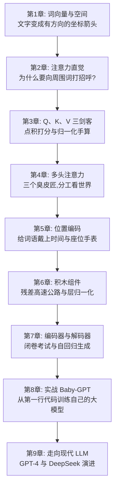

准备好你的好奇心与草稿纸，让我们正式开启这段激动人心的探索之旅！


---

# 第1章：从词语到数学世界——词嵌入（Word Embedding）与空间向量

> “世间万物皆有其空间位置，人类的语言亦不例外。”

---

## 1.1 计算机如何读懂文字？从“查字典”到“特征打分”

想象一下，你必须教会一台只能做四则运算（加减乘除）的计算器去阅读《西游记》。

计算机的芯片是硅晶片构成的电路，它天然只认识电位的高和低——也就是 **0 和 1**。它根本不知道什么是“苹果”，什么是“孙悟空”，更读不懂李白的“床前明月光”。

要让计算机处理语言，第一步必须是：**把字词翻译成数字**。

### 方案 1：给字典里的每个字编个号码？（朴素标号法）

很多初学编程的朋友第一反应是：这还不简单？买一本《新华字典》，按页码给每个字排个座次：

- 苹果 $\to 1$
- 梨子 $\to 2$
- 飞机 $\to 3$
- 导弹 $\to 4$

这种方法看似聪明，却会导致荒谬的数学灾难：

1. **强加的大小关系**：在数学里，$2 > 1$。难道“梨子”比“苹果”更“大”？难道“导弹”的大小是“飞机”加上“梨子”？
2. **扭曲的距离关系**：根据标号，$\text{梨子}(2) - \text{苹果}(1) = 1$，而 $\text{导弹}(4) - \text{飞机}(3) = 1$。这岂不是意味着在电脑眼里，“梨子和苹果的亲密程度”竟然与“导弹和飞机的亲密程度”完全一模一样？

显然，一个单一的标量（单数）根本承载不了人类语言中千丝万缕的复杂语义。

---

### 方案 2：全班点名册的窘境（One-Hot 独热编码）

后来，计算机科学家想到了另一种方法：假设我们的词表里一共有 10,000 个不同的词。我们准备一个长为 10,000 的长条数组，谁出场，谁对应的那个位置就写 1，其他人全部写 0：

- 苹果：$[1, 0, 0, 0, 0, \dots, 0]$
- 梨子：$[0, 1, 0, 0, 0, \dots, 0]$
- 香蕉：$[0, 0, 1, 0, 0, \dots, 0]$
- 宇宙：$[0, 0, 0, 0, 0, \dots, 1]$

这种编码方式被称为 **One-Hot（独热）编码**。它虽然解决了“谁大谁小”的乱序问题，却带来了更致命的缺陷：

> [!WARNING]
> **几何正交悲剧**：
> 回顾高一的平面与空间向量点积公式：
> $$\vec{a} \cdot \vec{b} = a_1 b_1 + a_2 b_2 + \dots + a_n b_n$$
> 在 One-Hot 编码下，任何两个不同的词向量，它们每一位对应相乘的结果必然全都是 0！
> $$\vec{v}_{\text{苹果}} \cdot \vec{v}_{\text{梨子}} = 0$$
> $$\vec{v}_{\text{苹果}} \cdot \vec{v}_{\text{宇宙}} = 0$$
> 
> 在几何上，这意味着**所有词与词之间都是 90 度互相垂直的（正交）**。在电脑眼里，“苹果”和“梨子”的关系，居然跟“苹果”和“宇宙”一样疏远冷漠！

---

## 1.2 高中平面向量回忆录：用“特征坐标系”给词语画像

怎样才能让电脑既不产生大小误解，又能看懂“苹果”和“梨子”很近，而“苹果”和“汽车”很远呢？

答案就在**高一数学必修第二册的平面向量**中！

让我们在平面上建立一个直角坐标系，但我们不叫它 $X$ 轴和 $Y$ 轴，而是给它们赋予鲜明的现实特征：

- **横坐标（维度 0）**：表示水果的 **“甜度”**（打分范围 0 到 10）
- **纵坐标（维度 1）**：表示水果的 **“脆度”**（打分范围 0 到 10）

现在，我们把各种水果放到这个坐标系中：

```
脆度 (Y轴)
  10 ▲
   9 ┼                 ● 苹果 (8, 9)
   8 ┼                   ● 梨子 (7.8, 8.5)
   7 ┼
   6 ┼
   5 ┼
   4 ┼
   3 ┼            ● 西瓜 (9, 3)
   2 ┼
   1 ┼   ● 香蕉 (8.5, 1)
   0 ┼─────────────────────────────────► 甜度 (X轴)
     0   1   2   3   4   5   6   7   8   9   10
```

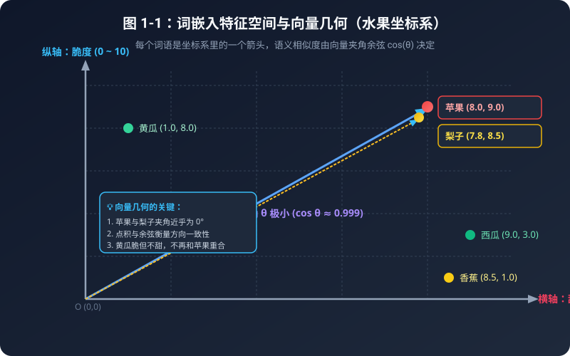

### 表 1-1：One-Hot 独热编码 vs 稠密词向量（Dense Embedding）全面对比表

| 对比维度 | One-Hot 独热编码 | 稠密词向量 (Embedding) |
| :--- | :--- | :--- |
| **向量形式** | 绝大多数是 0，只有一个 1（稀疏长条） | 全是连续实数，如 `[0.25, -1.34, 0.88]` |
| **典型向量长度** | 词表有多大就多长（如 100,000 维） | 紧凑精炼（通常 512 或 4096 维） |
| **两两点积结果** | **恒等于 0**（所有词互相正交垂直） | **反映真实语义**（近义词点积大，反义词点积负） |
| **内存与算力开销**| 巨大浪费（全是在乘无意义的 0） | 极致紧凑高效，GPU 矩阵加速顺畅 |
| **表达未知新词** | 毫无泛化能力 | 可通过空间插值获得合理的近似语义 |

---

### 表 1-2：5 种水果的三维特征评分与空间几何度量数据表

以基准词 **“苹果 (8.0, 9.0, 5.0)”** 为例进行距离与相似度计算：

| 水果名称 | 甜度 (X) | 脆度 (Y) | 价格 (Z) | 模长 \|v\| | 与苹果的欧氏距离 | 与苹果的余弦相似度 cos(θ) | 语义判定 |
| :--- | :---: | :---: | :---: | :---: | :---: | :---: | :--- |
| **苹果 (Apple)** | **8.0** | **9.0** | **5.0** | **13.04** | **0.0000** | **1.0000 (100%)** | **基准完全重合** |
| **梨子 (Pear)** | 7.8 | 8.5 | 4.8 | 12.51 | 0.5745 | **0.9999 (99.9%)** | **高度亲缘近义词** |
| **西瓜 (Watermelon)** | 9.0 | 3.0 | 1.5 | 9.60 | 7.0178 | **0.8504 (85.0%)** | 甜度相似但脆度有别 |
| **黄瓜 (Cucumber)** | 1.0 | 8.0 | 2.0 | 8.31 | 7.6811 | **0.8310 (83.1%)** | 脆度相似但完全不甜 |
| **香蕉 (Banana)** | 8.5 | 1.0 | 3.5 | 9.25 | 8.1548 | **0.7838 (78.4%)** | 软糯无脆度，距离最远 |


观察这个图与数据表，奇迹出现了：

1. **苹果** 的坐标是 $(8, 9)$，**梨子** 的坐标是 $(7.8, 8.5)$。它们在空间中几乎挨在一起！
2. **香蕉** 虽然也很甜 $(8.5)$，但它软糯不脆 $(1.0)$，所以它落在了右下角。
3. 只要计算它们在坐标系里的相对位置，电脑就能通过简单的加减乘除，立刻“心领神会”谁是谁的亲戚！

这就是现代大模型的基石——**词嵌入（Word Embedding，也称词向量）**：
> **词向量**：将大千世界里的每一个词，映射为一个高维空间里的多维坐标点（一个有方向的箭头）。每个维度，都暗中代表着这个词在某种特征上的测量值！

---

## 1.3 空间向量的几何度量：为什么点乘与余弦是天作之合？

在高中数学中，我们学过两种衡量两个向量关系的方法：

### 1. 欧氏距离（平面两点距离公式）

$$d(\vec{a}, \vec{b}) = \sqrt{(x_1 - x_2)^2 + (y_1 - y_2)^2}$$

距离越小，两点越近。但欧氏距离有一个缺点：如果一个词出现的词频极高，向量被整体拉长，点就会离原点很远，从而影响距离的判断。

### 2. 余弦相似度（夹角余弦）

高中物理和数学都告诉我们，两个向量的点积定义为：
$$\vec{a} \cdot \vec{b} = |\vec{a}| |\vec{b}| \cos\theta$$

我们稍作变形，就能解出夹角的余弦值：
$$\cos\theta = \frac{\vec{a} \cdot \vec{b}}{|\vec{a}| |\vec{b}|} = \frac{x_1 x_2 + y_1 y_2}{\sqrt{x_1^2 + y_1^2} \sqrt{x_2^2 + y_2^2}}$$

回顾高中三角函数性质：
- 当 $\theta = 0^\circ$ 时，$\cos 0^\circ = 1$：两个箭头**完全同向**，代表两个词的含义高度一致！
- 当 $\theta = 90^\circ$ 时，$\cos 90^\circ = 0$：两个箭头**相互垂直**，代表两个词风马牛不相及！
- 当 $\theta = 180^\circ$ 时，$\cos 180^\circ = -1$：两个箭头**方向完全相反**，代表它们在语义上几乎互为反义词！

> [!NOTE]
> **敲黑板**：
> 在 Transformer 和大语言模型中，几乎所有注意力打分、向量检索，核心都是在算**向量点积（Dot Product）**！点积的本质，就是在算这两个向量“在多大程度上心有灵犀（同向发力）”。

---

## 1.4 神奇的向量加减法：国王 - 男人 + 女人 = 女王

如果词向量仅仅能用来算相似度，那还不足以被称为“大模型的魔法”。词向量最震撼科学界的一幕，是它支持**几何平移与逻辑运算**！

假设我们有以下四个词向量，每个向量有 3 个特征维度：
`[权力地位 (0~10), 男性特征 (-10~+10), 年龄成熟度 (0~10)]`

- 国王 (King)  = $[9.0, \ \ 8.0, \ 7.0]$
- 男人 (Man)   = $[1.0, \ \ 8.0, \ 5.0]$
- 女人 (Woman) = $[1.0, -8.0, \ 5.0]$
- 女王 (Queen) = $[9.0, -8.0, \ 7.0]$

现在，让我们用高一的向量加减法做一个小实验：
$$\vec{v}_{\text{运算结果}} = \vec{v}_{\text{国王}} - \vec{v}_{\text{男人}} + \vec{v}_{\text{女人}}$$

让我们逐个分量计算：
- 维度 0（权力）：$9.0 - 1.0 + 1.0 = 9.0$ （依然拥有至高无上的权力！）
- 维度 1（性别）：$8.0 - 8.0 + (-8.0) = -8.0$ （脱去了男性特征，换成了女性特征！）
- 维度 2（年龄）：$7.0 - 5.0 + 5.0 = 7.0$ （依然保持成熟的君主仪态！）

运算结果向量为：$[9.0, -8.0, 7.0]$。
上面的女王坐标是按这个结果写好的，所以相似度会精确等于 1。
这是一个玩具例子，用来看清著名的 Word2Vec 现象：真实语料里学出来的向量只能**近似**满足“国王 - 男人 + 女人 ≈ 女王”，不会每个小数都对上。

```
        ▲ 权力维度
        │
  [女王]│●───────────────● [国王]
        ││               │
        ││-男人 +女人    │
        ││               │
        │▼               │
  [女人]│●───────────────● [男人]
        └────────────────────────► 性别维度 (左女右男)
```

这就是高中平面几何的**平行四边形定则**在语义空间里的完美映射！语言中的“性别对立”、“尊卑关系”、“时态变化”，全部被投影成了空间里的几何平行线！

---

## 1.5 手把手代码：纯 Python 验证词向量与相似度

让我们打开配套代码 [code/01_vector_similarity.py](../code/01_vector_similarity.py)，看看不用任何外部库，只用纯粹的高中数学与 Python 基础语法是如何实现的：

```python
import math

def dot_product(vec_a, vec_b):
    """
    计算两个向量的点积（内积）
    高一代数公式：a · b = x1*x2 + y1*y2 + ... + xn*yn
    """
    assert len(vec_a) == len(vec_b), "两个向量的维度必须完全相同！"
    total = 0.0
    for i in range(len(vec_a)):
        total += vec_a[i] * vec_b[i]
    return total

def vector_magnitude(vec):
    """
    计算向量的模长（也就是箭头的长度）
    高中几何公式：|a| = √(x1² + x2² + ... + xn²)
    """
    sum_of_squares = 0.0
    for val in vec:
        sum_of_squares += val ** 2
    return math.sqrt(sum_of_squares)

def cosine_similarity(vec_a, vec_b):
    """
    计算余弦相似度 cos(θ) = (a · b) / (|a| * |b|)
    """
    dot = dot_product(vec_a, vec_b)
    mag_a = vector_magnitude(vec_a)
    mag_b = vector_magnitude(vec_b)
    if mag_a == 0 or mag_b == 0:
        return 0.0
    return dot / (mag_a * mag_b)
```

运行该脚本后，控制台会输出：

```text
基准词：苹果 (Apple)，坐标向量为：[8.0, 9.0, 5.0]

目标词语           | 余弦相似度 (越高越近)  | 欧氏距离 (越小越近)
------------------------------------------------------------
梨子 (Pear)      |        0.9999        |     0.5745     
西瓜 (Watermelon)|        0.8504        |     7.0178     
黄瓜 (Cucumber)  |        0.8310        |     7.6811     
香蕉 (Banana)    |        0.7838        |     8.1548     
```

同时，运算结果和事先写好的女王向量，余弦相似度是 **1.0000**。脚本会直接告诉你：这是配出来的例子，不是词典查询的巧合。按余弦相似度排序，和苹果差得最远的是香蕉，不是黄瓜。

---

## 1.6 本章小结与思考题

1. **本章核心收获**：
   - 计算机读懂文字的第一步，是将词语映射为多维特征空间里的向量（箭头）。
   - 两个词语越相似，它们在空间里的夹角越小，点积和余弦相似度越接近 1。
   - 语言中蕴含的复杂逻辑，可以通过几何空间的加减法（向量平移）实现。

2. **课后思考题**：
   - 如果一个词在不同语境下有完全不同的含义，比如“我买了一斤苹果（水果）”和“我买了一台苹果（电脑）”，静态的词向量能区分它们吗？
   - 如果不能，我们该如何让词向量根据周围的同伴，动态地“改变自己的形状”呢？

带着这个问题，让我们迈向下一章：**注意力机制的直觉与诞生**！


---

# 第2章：注意力机制的直觉——为什么我们需要“注意力”？

> “如果一个词在字典里只有一个死板的坐标，那它就永远无法理解人类多姿多彩的心灵。”

---

## 2.1 静态词向量的死穴：一词多义的尴尬

在第 1 章中，我们见证了词向量的几何魅力：每一个词都是高维空间里的一个漂亮箭头。

然而，现实生活中的人类语言有一个巨大的“陷阱”——**一词多义（Polysemy）与语境依赖**。

请看下面两句话：
1. **“秋天到了，红富士**苹果**又脆又甜。”**
2. **“乔布斯在发布会上推出了新款**苹果**手机。”**

在这两句话中，都出现了“苹果”这个词。但只要是通晓汉语的人，瞬间就能明白：
- 第一句里的“苹果”，指的是长在树上的多汁水果；
- 第二句里的“苹果”，指的是估值数万亿美元的科技巨头和电子设备！

然而，在传统的静态词向量（如 Word2Vec）世界里，**每个词在坐标系里的位置是终生固定的**。查词表时，“苹果”永远只有那一个坐标 $[8.0, 9.0, 5.0]$。

```
   传统静态词向量：
   [苹果] 永远只有一个死板坐标 ───► (8.0, 9.0, 5.0) 
   （不管是水果店还是科技发布会，都是同一个数字）

   理想的智能词向量：
   语境 A (水果店) ────────► [苹果] 动态变形为 [多汁, 甜度, 农产品] 向量
   语境 B (发布会) ────────► [苹果] 动态变形为 [科技, 芯片, 高端电子] 向量
```

如果模型无法根据**一句话里的其他词（上下文）**来动态调整这个词的含义，机器翻译、文本理解和聊天机器人就会闹出天大的笑话（比如把“我买了一部苹果”翻译成“I bought a fruit”）。

---

## 2.2 传统时代的传话游戏：RNN 的长距离遗忘症

在 Transformer 诞生之前，人工智能领域统治自然语言处理长达数年的是 **RNN（循环神经网络）** 及其变体 **LSTM**。

RNN 处理一句话的方式，非常像小学课间玩过的**“传话游戏”**：

```
 [小明] ───► [在] ───► [草地上] ───► [给] ───► [小狗] ───► ... ───► [它]
   │          │           │           │          │                  │
 记忆箱1 ──► 记忆箱2 ───► 记忆箱3 ───► 记忆箱4 ──► 记忆箱5 ───...───► 最终记忆箱
```

它的工作逻辑是：
1. 读入第 1 个词“小明”，把信息塞进一个小小的“记忆箱（隐藏状态）”；
2. 读入第 2 个词“在”，把“在”和之前的记忆箱混合，更新记忆箱；
3. 一直传下去，直到读完最后一个词。

这种设计有两大致命硬伤，直接把 AI 科学家们逼入了绝境：

### 痛点 1：金鱼的记忆（长距离遗忘与信息瓶颈）

传话游戏玩到第 50 个人时，最初的话早就被篡改得面目全非了。
在数学上，由于信息要经历几十次连乘，会导致著名的**梯度消失（Vanishing Gradient）**问题。到了句尾，网络早就把句首讲了什么忘得一干二净！

### 痛点 2：串行计算枷锁（无法利用现代 GPU 狂飙）

现代超级计算机的核心是 GPU（图形处理器）。一块英伟达 GPU 拥有**数万个计算核心**，最擅长同时做几万件互不干扰的事情（大规模并行计算）。

但 RNN 就像排队买奶茶：算第 5 个词之前，必须先等第 4 个词算完；算第 4 个词之前，必须等第 3 个词算完……
这会限制训练时能并行展开的工作量，让超长序列和超大模型的训练更难扩展。

### 表 2-1：传统循环网络 (RNN) vs 现代自注意力 (Transformer) 全方位对比表

| 对比维度 | 传统循环网络 (RNN / LSTM) | 现代自注意力 (Transformer) |
| :--- | :--- | :--- |
| **计算时空顺序** | **串行依赖**（$t=1 \to 2 \to 3 \dots$） | 训练时可把整句组织成批量矩阵运算 |
| **首尾信息传递步数** | **$O(N)$ 步**（经过 $N$ 次衰减传话链条） | **$O(1)$ 步**（任意两词直接算点积，一步直达） |
| **长文本信息路径** | 跨越很多步时更容易出现记忆衰减，LSTM 等门控结构可以缓解 | 任意两词可以直接建立连接；长文本仍会受到计算量和上下文窗口限制 |
| **GPU 硬件利用率** | 训练时受串行依赖限制，并行空间较小 | 训练时更适合批量矩阵运算；实际利用率仍取决于硬件和实现 |
| **规模扩展** | 训练长序列时效率受限 | 更容易扩展到大参数模型，但成本和工程难度仍然很高 |

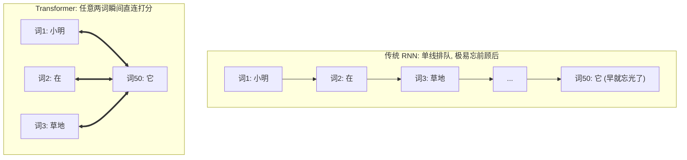

## 2.3 人是怎么读出“它”指谁的？

下面这张表是**教学示意**，不是某一次真实模型测出来的百分比。格子里的数被凑成了 100%，用来表现聚光灯可以换焦点。语言现象本身是真的：同一套句式里，“它”有时指动物，有时指马路。

### 表 2-2：代词“它”在不同语境下的注意力权重示意表

| 句子 A：“动物 没有 穿过 马路 因为 **它** 太累了” | | 句子 B：“动物 没有 穿过 马路 因为 **它** 太宽了” | |
| :--- | :---: | :--- | :---: |
| **候选词语** | **分配注意力权重 (%)** | **候选词语** | **分配注意力权重 (%)** |
| **动物** | **84.6% (高光聚焦!)** | 动物 | 3.2% |
| 马路 | 4.1% | **马路** | **88.5% (高光聚焦!)** |
| 穿过 | 5.2% | 穿过 | 4.1% |
| 因为 | 2.5% | 因为 | 1.8% |
| 太累了 / 太宽了 | 3.6% | 太宽了 | 2.4% |

人类在理解一个词时，**从来不是从头到尾死记硬背地线性传话**，而是在阅读当前词的同时，**把聚光灯投射到整句话中最相关的几个关键部位上**！

这种“给关键信息分配更高权重、忽略无关杂音”的能力，就是人类智慧的核心——**注意力（Attention）**。

---

## 2.4 自注意力（Self-Attention）的伟大思想：全员无死角握手

2017 年，Google 的学者们灵光一闪：
**既然注意力这么好用，我们为什么还要保留慢吞吞的 RNN 传话链条？为什么不把所有多余的脚手架全拆了？**

这就是轰动世界的论文标题：**《Attention Is All You Need》（注意力就是你所需要的一切）**！

他们提出的核心思想，叫做 **自注意力机制（Self-Attention）**：

> [!IMPORTANT]
> **自注意力机制的灵魂法则**：
> 1. **全员连接，训练可并行**：训练时一句话里的所有词（词 1 到词 $N$）可以一起送入矩阵运算，不必像 RNN 那样逐词等待；生成时仍然要一个词一个词地进行。
> 2. **主动打招呼**：句子里的每一个词，都会主动向句子里的**所有词（包括它自己）**打招呼，询问：“我和你之间有多大的相关性？”
> 3. **计算动态权重**：如果两个词很相关（比如“苹果”和“手机”），它们之间的打分就极高；如果不相关（比如“苹果”和“草地”），打分就极低。
> 4. **加权吸取营养**：每个词吸纳所有相关词的信息，重新打造一个全新的、充满语境智慧的词向量！

```
     [我] ◄────互相打招呼并打分────► [爱]
      ▲                               ▲
      │            [自注意力]          │
      ▼         全连接网络信息交互      ▼
     [学] ◄────────────────────────► [大模型]
```

通过这一招：
1. **信息路径更短**：第 1 个词和第 1000 个词可以直接算一次相关性打分，减少了逐步传话的中间环节；这不等于长文本问题已经彻底消失。
2. **更适合并行计算**：所有词两两之间的打分可以组织成批量矩阵乘法，交给 GPU 并行处理；速度仍受序列长度、显存和实现影响。

---

## 2.5 本章小结

- **静态词向量**无法解决一词多义和语境变化问题。
- **RNN/LSTM** 传话模型存在“长距离遗忘”和“无法并行计算”两大天然死穴。
- **注意力机制**模仿人脑的聚光灯，让每个词都能直接聚焦到句子中最相关的词上。
- **自注意力机制**减少了训练时的逐词等待，让整句信息交互更适合并行矩阵计算；自回归生成仍然是逐步的。

可是，电脑到底怎么给两个词之间的“相关度”打分？
传说中像特工代号一样的 **Q (Query)、K (Key)、V (Value)** 究竟是什么意思？

翻开下一章，我们将用高中数学点积公式和最生动的生活案例，彻底揭开注意力计算的神秘面纱！


---

# 第3章：拆解注意力三剑客——Q、K、V 的生活大冒险与点积计算

> “在注意力的宇宙里，每一个词都拥有三副面孔：探寻者、被寻者与传道者。”

---

## 3.1 现实世界的绝妙类比：图书馆检索与购物搜索

在任何关于 Transformer 的文献中，你都会看到三个高频出现的英文字母：
- **$Q$**：Query（查询）
- **$K$**：Key（键 / 索引标签）
- **$V$**：Value（值 / 实际内容）

初学者往往会被这些数据库术语弄得一头雾水。别急，让我们来到日常生活中最熟悉的一个场景——**去图书馆借书**（或者在电商 App 里网购）：

```
 ┌─────────────────────────────────────────────────────────────────┐
 │                      生活中的 Q、K、V 映射表                    │
 ├──────────┬─────────────────────────────┬────────────────────────┤
 │ 角色     │ 图书馆借书场景              │ 大模型注意力世界       │
 ├──────────┼─────────────────────────────┼────────────────────────┤
 │ Q (Query)│ 你在检索机屏幕输入的搜索词  │ 当前词“我想找什么样的词│
 │          │ （例如：“高一物理必修一教辅”）│  来帮助我理解上下文？” │
 ├──────────┼─────────────────────────────┼────────────────────────┤
 │ K (Key)  │ 书架上每本书脊梁上的分类标签│ 候选词“我的身份名片是  │
 │          │ （例如：“高一物理”、“初中语文”│  什么？凭什么能吸引你？”│
 ├──────────┼─────────────────────────────┼────────────────────────┤
 │ V (Value)│ 翻开书本后，里面真正的印刷字│ 候选词“我能贡献给你的  │
 │          │ 体与知识实质                │  真实上下文语义内容”   │
 └──────────┴─────────────────────────────┴────────────────────────┘
```

当你拿着你的 **Query ($Q$)** 走向书架时：
1. 你会拿着 $Q$，去和每一本书的 **Key ($K$)** 挨个比对；
2. 如果书架标签写着“高一物理必修一”，它和你的检索词高度匹配，**相关度得分（Score）极高（比如 95%）**；
3. 如果标签写着“初中英语语法”，匹配度极低，**得分几乎为 0%**；
4. 最后，你根据这些匹配得分，决定重点汲取哪本书的 **Value ($V$)**（把打分高的书里的知识装进脑海，打分低的书直接忽略）。

---

## 3.2 为什么同一个词需要“变身”为三种角色？

你可能会产生一个强烈的疑问：
> “一句话里的词，本来只有一个词向量 $X$。为什么非要把自己克隆并转换成 $Q$、$K$、$V$ 三个不同的向量呢？直接拿 $X$ 和 $X$ 算相似度不行吗？”

这是一个极其深刻的问题！让我们看一个人类社交的例子：

在班级交流中，一个人往往拥有三种截然不同的心理状态：
1. **提问状态 ($Q$)**：“我当前遇到了物理大题的困难，谁能帮帮我？”
2. **被检索状态 ($K$)**：“我的特长是数学和物理，如果有人想问理科题，可以来找我。”
3. **倾囊相授状态 ($V$)**：“既然你向我求助，我把我脑海里的解题步骤和思考逻辑讲给你听。”

如果**不加区分**，强行让 $Q = K = V = X$：
- 两个词向量点积 $\vec{x}_i \cdot \vec{x}_j$ 必然是对称的（$\vec{a} \cdot \vec{b} = \vec{b} \cdot \vec{a}$）；
- 这意味着“词 A 对 词 B 的关注度”将**被迫严格等于**“词 B 对 词 A 的关注度”！

但这在自然语言中是完全不合理的：
- 在句子“动词（吃）”和“名词（苹果）”中，“吃”非常迫切地需要寻找一个宾语作为承受者（“吃”对“苹果”的注意力应该极高）；
- 但“苹果”本身作为一个名词，它可能更关心修饰它的形容词“红色的”或代词“我的”，而不一定把所有重心都扑在“吃”上。

通过三个独立的线性变换矩阵 $W_Q, W_K, W_V$，每个词被赋予三副不同的面孔。论文里通常把词向量横着写成一行：
$$Q = X W_Q, \quad K = X W_K, \quad V = X W_V$$
配套代码把同一个向量竖过来，用“矩阵的每一行去点这个向量”。两种写法乘出来的数字相同，只是横竖不同。第 3.4 节会带你用手把 0.6 和 0.5 算一遍。

---

## 3.3 注意力计算五步法（高中古典算术拆解）

现在，让我们把那个价值千亿美金的经典注意力公式：
$$\text{Attention}(Q, K, V) = \text{Softmax}\left(\frac{Q K^T}{\sqrt{d_k}}\right) V$$
拆解成任何人都能看懂的 **五步基础算术运算**！

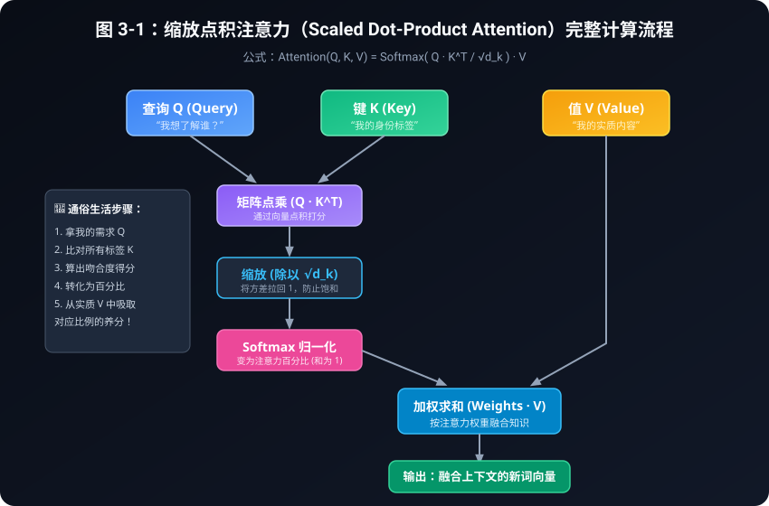

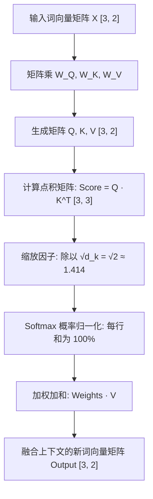

### 表 3-1：为什么除以 $\sqrt{d_k}$？手写分数的 Softmax 对照

这些原始分数是为了方便用计算器核对而选的，不是某一次随机实验的输出。每一行三个百分比加起来都是 100%。

| 维度 $d_k$ | 标准差 $\sqrt{d_k}$ | 手写的原始分数 | **不除以 $\sqrt{d_k}$** | **除以 $\sqrt{d_k}$ 之后** |
| :---: | :---: | :---: | :--- | :--- |
| **2** | 1.41 | $[0.6,\ 1.0,\ 1.1]$ | 24.15%，36.03%，39.82% | 26.66%，35.37%，37.97% |
| **16** | 4 | $[4.2,\ -1.5,\ 8.9]$ | 0.90%，0.00%，**99.10%** | 22.33%，5.37%，**72.30%** |
| **64** | 8 | $[-8.6,\ -13.0,\ -4.3]$ | 1.34%，0.02%，**98.65%** | **30.41%，17.54%，52.05%** |
| **128** | 11.31 | $[15,\ -8,\ 26]$ | 0.00%，0.00%，**100%** | **26.49%，3.47%，70.04%** |

维度只有 2 时，除不除差别不大。维度到了 16 以上，不缩放的 Softmax 会把几乎全部注意力堆到一个数上。

想看真实随机向量，请运行 [code/03_scaled_dot_product.py](../code/03_scaled_dot_product.py)。随机种子固定为 42、维度为 64 时，三次点积大约是 $-8.57$、$-13.00$、$-4.31$。不缩放的权重是 1.39%、0.02%、98.59%；除以 8 之后变成 30.50%、17.54%、51.96%。现象和上表是同一类。

---

### Step 1：特征投影（线性变换）
将输入词向量 $X$（假设长度为 $d_{model}$）分别乘上三个可学习的权重矩阵 $W_Q, W_K, W_V$。
高中几何直觉：就像在二维平面上把一个坐标系进行拉伸和旋转，把原始的通用属性，换算成专门用于“提问”、“名片”和“内容”的新属性。

### Step 2：打分计算（向量点积）
计算词 $i$ 的查询向量 $Q_i$ 与词 $j$ 的键向量 $K_j$ 的点乘：
$$\text{RawScore}_{i, j} = Q_i \cdot K_j = \sum_{m=1}^{d_k} Q_{i, m} \times K_{j, m}$$
回忆高一平面向量：方向越接近，点积越大；方向垂直，点积为 0；方向相反，点积为负！

---

### Step 3：缩放因子——为什么神谕般地除以 $\sqrt{d_k}$？

这是全书**最精彩的高中数学推导**之一！很多研究生都只是死记公式，今天我们用高二统计学把它彻底看透。

> [!CAUTION]
> **方差爆炸危机与 Softmax 饱和**：
> 假设向量维度是 $d_k$（例如在真实大模型中 $d_k = 64$）。
> 这个推导用在**模型刚开始、数字还是随机的时候**：假设 $Q$ 和 $K$ 里的每一个数互不相关，均值是 0，方差是 1。训练以后数字会变，但“先除以 $\sqrt{d_k}$”这个习惯被保留了下来。
> 
> 回忆高二统计学原理：
> 1. 如果变量 $X, Y$ 独立，均值为 0，方差为 1，那么乘积 $Z = X \cdot Y$ 的均值也是 0，方差 $\text{Var}(Z) = 1$；
> 2. 点乘是把 $d_k$ 个这样的乘积**加在一起**：
>    $$\text{Score} = \sum_{m=1}^{d_k} (Q_m \cdot K_m)$$
> 3. 根据方差的加法法则，相互独立的随机变量相加，方差也相加：
>    $$\text{Var}(\text{Score}) = 1 + 1 + \dots + 1 = d_k$$
> 4. 方差是 $d_k$，那么**标准差（波动幅度）**就是：
>    $$\sigma = \sqrt{d_k}$$

当 $d_k = 64$ 时，标准差高达 $\sqrt{64} = 8$！
这意味着计算出来的原始点积分数，经常会出现 $+24$ 甚至更大，或者 $-20$ 这样极端的数字。

接下来要送入 Softmax 计算：
$$\text{Softmax}(x_i) = \frac{e^{x_i}}{\sum e^{x_j}}$$
如果输入是 $[24, 0, -5]$：
- $e^{24} \approx 2.6 \times 10^{10}$
- $e^0 = 1$
- 最大的那个数占了总和的 **99.99999999%**，其他数字全变成 **0.00000000%**！

**可能带来的问题**：
这就像期末考试全班只有一个人考了 1000 分，其他人都是 0 分。函数会进入较平的饱和区，相关位置的梯度可能变小，学习变得困难。实际模型还要靠初始化、归一化和优化器等设计共同维持训练稳定。

**解药**：
把点积结果除以标准差 $\sqrt{d_k}$！
$$\frac{\text{Score}}{\sqrt{d_k}}$$
根据高中的标准化公式，把一个方差为 $d_k$ 的变量除以 $\sqrt{d_k}$，它的方差被稳稳地**拉回了 1**！分数温和健康，Softmax 能够平滑而公正地分配注意力！

---

### Step 4：Softmax 归一化（把分数换成百分比）

高一同学请看：Softmax 到底在干嘛？
1. **第一步：消除负数**。取指数 $e^x$。因为对任何实数 $x$，$e^x$ 恒大于 0。
2. **第二步：全员加和**。求出全班的总分数之和。
3. **第三步：求占比**。每个人的 $e^x$ 除以总和。
结果是一组**非负、并且加起来等于 1.0 (100%)** 的权重；在有限精度下，极小的数可能显示成 0，经过掩码的位置则会被明确置为 0。

---

### Step 5：加权求和（吸收精华）

得到了每个词的注意力百分比权重 $A_{i, j}$ 之后，将它们分别乘上对应词的实际内容向量 $V_j$，然后加在一起：
$$\vec{v}_{\text{新}} = A_{i, 1} \cdot V_1 + A_{i, 2} \cdot V_2 + \dots + A_{i, N} \cdot V_N$$
就像按配方调配一杯鸡尾酒：30% 的伏特加 + 50% 的橙汁 + 20% 的柠檬糖浆，最终调制出一杯风味独特的特调饮品！

---

## 3.4 纯 Python 纯手工算一遍代码精讲

现在，让我们拿出草稿纸，阅读 [code/02_manual_attention.py](../code/02_manual_attention.py)。

假设句子只有 3 个词：“我”、“爱”、“学”。我们设定词向量维度为 2。权重矩阵是手写的，不是训练出来的。以“我”$=[1.0,\ 0.5]$ 为例，查询向量的两个数是：

$$
\begin{aligned}
Q_0 &= 0.5 \times 1.0 + 0.2 \times 0.5 = 0.6 \\
Q_1 &= 0.1 \times 1.0 + 0.8 \times 0.5 = 0.5
\end{aligned}
$$

请先在草稿纸上算出这两个数，再对照程序打印的 `Q=[0.600, 0.500]`。

```python
words = ["我", "爱", "学"]
x = [
    [1.0, 0.5],  # “我”
    [0.8, 1.2],  # “爱”
    [0.2, 1.5]   # “学”
]
```

代码通过矩阵乘以向量得到每一个词的 Q, K, V：
```text
词 '我': Q=[0.600, 0.500], K=[0.550, 0.550], V=[1.050, 0.450]
词 '爱': Q=[0.640, 1.040], K=[0.680, 1.000], V=[0.920, 1.080]
词 '学': Q=[0.400, 1.220], K=[0.530, 1.090], V=[0.350, 1.350]
```

接着进行点乘并除以 $\sqrt{2} \approx 1.414$：
```text
打分矩阵 (未归一化):
              目标:我        目标:爱        目标:学
查询:我       0.4278      0.6421      0.6102
查询:爱       0.6534      1.0431      1.0414
查询:学       0.6300      1.0550      1.0902
```

经过 Softmax 转换为百分比：
```text
注意力权重矩阵 (Attention Weights %):
              目标:我        目标:爱        目标:学
查询:我       29.08%      36.03%      34.90%
查询:爱       25.31%      37.38%      37.31%
查询:学       24.31%      37.18%      38.51%
```

最后进行加权平均，计算出全新的“我”：
- 吸收自身“我”的 $V$ 的 29.08%
- 吸收“爱”的 $V$ 的 36.03%
- 吸收“学”的 $V$ 的 34.90%
- **合成出的新“我” = $[0.7589, 0.9910]$**

这一行行加减乘除，就是注意力里最基本的计算单元。矩阵是手写的，所以这次还不能叫“模型读懂了这句话”，只能叫“混合手续已经走通”。

---

## 3.5 本章小结

- **Q、K、V** 是同一个词的三种角色映射：Q 是搜索词，K 是标签，V 是内容。
- **点积**用来度量向量夹角与相关性。
- **除以 $\sqrt{d_k}$** 是为了抵消高维方差累加效应，防止 Softmax 梯度饱和。
- **Softmax** 将分数转化为和为 100% 的概率权重。
- **加权求和**将所有相关词的 Value 汇聚成融合上下文的全新表示。

但是，如果只用一套 Q、K、V，就像一个人只有一双眼睛，只能从一个固定的角度看世界。
能不能像神话里的二郎神或者哪吒一样，拥有“三头六臂”，同时从多个维度审视一句话呢？
请看下一章：**多头注意力（Multi-Head Attention）**！


---

# 第4章：多头注意力（Multi-Head Attention）——三个臭皮匠，顶个诸葛亮

> “单重视角只能管中窥豹，多重視角方能纵览乾坤。”

---

## 4.1 为什么要“多头”？单重视角的尴尬盲区

在第 3 章中，我们学会了用一套 $Q, K, V$ 矩阵计算自注意力。
但很快，AI 研究员们就发现了一个棘手的瓶颈：**人类语言的关系太丰富了，单双眼睛根本看不过来！**

请读下面这句稍微复杂的英文句子（或其中文意译）：
> **“The bank robber deposited the stolen money into another bank.”**
> （那个银行抢劫犯把偷来的钱存进了另一家银行。）

在这句话中，包含了多种截然不同层面的语言逻辑：
1. **主谓宾语法关系**：“抢劫犯（robber）” 做了 “存钱（deposited）” 这个动作；
2. **修饰语关系**：“偷来的（stolen）” 修饰 “钱（money）”；
3. **代词与指代消解**：“另一家（another）” 指的是后文的 “银行（bank）”，而不是抢劫犯；
4. **语境安全与主题关系**：“抢劫犯”和“银行”共同触发了“金融犯罪”的上下文背景。

如果我们只有一个注意力头（Single-Head Attention）：
对于“抢劫犯”这个词，它每次和别的词打招呼，只能算出一个**唯一的标量打分**。
如果它把 80% 的注意力都投给了动词“存”，它就分不出多余的精力去关注“钱”和“另一家银行”。它必须在所有关系之间艰难地做妥协和折衷！

```
单头注意力 (Single Head):
      [抢劫犯] ───(唯一视角: 顾此失彼)───► 既要看主谓,又要看修饰,精力不够用

多头注意力 (Multi-Head):
      [抢劫犯] ──┬──► [头 1: 语法专家] ────► 专抓: 主语 robber 对应动词 deposited
                 ├──► [头 2: 指代专家] ────► 专抓: another 对应 bank
                 └──► [头 3: 情感/主题专家] ──► 专抓: 犯罪词汇与金融安全
```

这就是 **多头注意力（Multi-Head Attention）** 的诞生原因：
**让不同的“专家小分队”（不同的注意力头）独立去观察句子的不同特征，各自独立打分，最后把大家的观察报告拼在一起！**

---

## 4.2 空间投影切片魔术：计算量并没有翻倍！

很多刚接触 Transformer 的初学者会产生一个巨大的误区：
> “如果模型有 8 个头，那岂不是要算 8 遍庞大的神经网络？计算量和显存岂不是暴增了 8 倍？”

**答案是：完全不会！这里的工程数学设计堪称神来之笔！**

在 Transformer 中，设计师们玩了一个极其精妙的**“空间切分游戏”**：

假设一个词向量的总维度是 $d_{model} = 512$。
我们想要 $h = 8$ 个注意力头。
模型**不是**把每个头都做成 512 维，而是把总维度 $512$ **均匀切成 8 份**：
$$d_k = \frac{d_{model}}{h} = \frac{512}{8} = 64$$

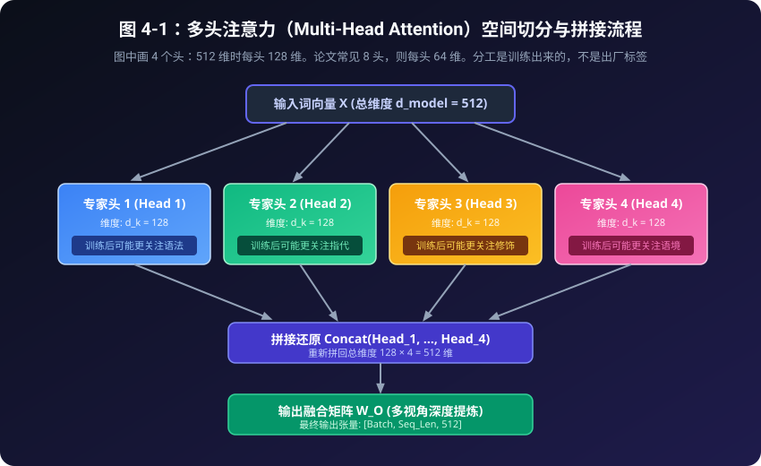

图中为了画得下，只画了 4 个头。总维度 512 切成 4 头时，每个头 128 维；正文例子里的 8 头，则是每个头 64 维。两种切法的总维度都是 512。图上的“可能更关注语法”是训练之后**有时**会出现的分工，不是程序里写死的标签。

### 表 4-1：单头注意力 vs 多头注意力（Multi-Head）全方位对比表

| 对比维度 | 单头注意力 (Single-Head) | 多头注意力 (Multi-Head, $h=8$) |
| :--- | :--- | :--- |
| **观察视角数量** | **单一视角**（只有一个注意力权重矩阵） | **多重視角**（8 个专家头各自独立打分） |
| **关系捕捉能力** | 顾此失彼（抓了主谓，漏了指代） | **面面俱到**（头1抓主谓，头2抓指代，头3抓情感） |
| **子空间维度** | $d_{model} = 512$（单一大维度） | 8 个小头，每个 $d_k = 64$（低维切片） |
| **理论计算量** | $\mathcal{O}(N^2 \cdot d_{model})$ | $\mathcal{O}(N^2 \cdot (h \cdot d_k)) = \mathcal{O}(N^2 \cdot d_{model})$ (**几乎完全相同！**) |
| **参数量开销** | 与单头几乎完全一样 | 与单头几乎完全一样（$W_Q, W_K, W_V, W_O$ 大小不变） |

---

### 表 4-2：多头注意力张量（Tensor）形状演化全流程追踪表

以批次大小 $B=1$、句子长度 $T=4$、总特征维度 $D=8$、头数 $h=2$、单头维度 $d_k=4$ 为例：

| 阶段步骤 | 执行代码操作 | 张量形状 (Shape) | 几何/物理现实含义 |
| :---: | :--- | :---: | :--- |
| **1. 输入特征** | `x` | `[1, 4, 8]` | 1 句话，4 个词，每个词有 8 个特征 |
| **2. 线性投影** | `Q = W_q(x)` | `[1, 4, 8]` | 生成 4 个词的完整查询需求 |
| **3. 空间切片** | `Q.view(1, 4, 2, 4)` | `[1, 4, 2, 4]` | 把 8 维特征切分为 2 个头，每个头 4 维 |
| **4. 维度换轴** | `.transpose(1, 2)` | `[1, 2, 4, 4]` | **核心！** 把 2 个头提到前面，独立算矩阵乘法 |
| **5. 批量打分** | `Q @ K.T / √d_k` | `[1, 2, 4, 4]` | 2 个头分别算出各自独立的 $4 \times 4$ 注意力表 |
| **6. 加权求和** | `Weights @ V` | `[1, 2, 4, 4]` | 各头各自融合属于自己视角的上下文向量 |
| **7. 换轴还原** | `.transpose(1, 2)` | `[1, 4, 2, 4]` | 准备重新拼接 |
| **8. 拼接压平** | `.contiguous().view()`| `[1, 4, 8]` | 两个 4 维头重新拼合成一个完整的 8 维向量 |
| **9. 输出融合** | `W_o(out)` | `[1, 4, 8]` | 融会贯通多头专家意见，输出最终新向量 |

---

## 4.3 破解矩阵维度变形术（初学者友好版张量图解）

在阅读实际代码时，初学者最容易被 PyTorch 里的 `view` 和 `transpose` 搞晕。让我们用最通俗的语言，彻底理清张量（多维数组）维度的变化全流程。

假设我们有一句话，包含 **4 个字**（比如“机器”、“学习”、“真”、“酷”）。
设批次大小 $\text{Batch} = 1$，词向量总维度 $d_{model} = 8$，分成 $h = 2$ 个头，每个头维度 $d_k = 4$。

### 维度演变 6 步曲：

```
1. 初始输入 x:
   形状: [Batch=1, Seq_Len=4, d_model=8]
   含义: 1 句话，4 个字，每个字身上有 8 个特征指标。

2. 线性投影生成 Q, K, V:
   通过 W_q 变换，形状依然是: [1, 4, 8]

3. 切分多头 (View 切片):
   把最后的 8 维切成 [2, 4]:
   形状变为: [Batch=1, Seq_Len=4, Heads=2, Head_Dim=4]

4. 维度换轴 (Transpose 调换):
   把 Heads 轴挪到前面，变成: [Batch=1, Heads=2, Seq_Len=4, Head_Dim=4]
   【为什么必须换轴？】
   因为 PyTorch 的批量矩阵乘法默认只对“最后两个维度”操作！
   换轴后，每个头就可以在自己的 [Seq_Len=4, Head_Dim=4] 空间里，独立算出 [4, 4] 的打分矩阵！

5. 多头注意力独立打分加权:
   输出形状依然是: [Batch=1, Heads=2, Seq_Len=4, Head_Dim=4]

6. 换轴还原并拼接 (Concat):
   先把维度换回来: [1, 4, 2, 4]
   然后把后两个维度压平拼合: [Batch=1, Seq_Len=4, d_model=8]
   最后通过一个输出矩阵 W_O 融合提炼！
```

---

## 4.4 动手看代码：多头注意力机制实操

打开配套源码 [code/04_multi_head_attention.py](../code/04_multi_head_attention.py)，让我们看看 PyTorch 类 `SimpleMultiHeadAttention` 的核心代码结构：

```python
class SimpleMultiHeadAttention(nn.Module):
    def __init__(self, d_model, num_heads):
        super().__init__()
        self.d_model = d_model
        self.num_heads = num_heads
        self.head_dim = d_model // num_heads

        # 线性映射层
        self.W_q = nn.Linear(d_model, d_model, bias=False)
        self.W_k = nn.Linear(d_model, d_model, bias=False)
        self.W_v = nn.Linear(d_model, d_model, bias=False)
        self.W_o = nn.Linear(d_model, d_model, bias=False)

    def forward(self, x):
        batch_size, seq_len, _ = x.shape

        # 1. 投影生成 Q, K, V
        Q = self.W_q(x)
        K = self.W_k(x)
        V = self.W_v(x)

        # 2. 切分多头并换轴: [batch, heads, seq_len, head_dim]
        Q = Q.view(batch_size, seq_len, self.num_heads, self.head_dim).transpose(1, 2)
        K = K.view(batch_size, seq_len, self.num_heads, self.head_dim).transpose(1, 2)
        V = V.view(batch_size, seq_len, self.num_heads, self.head_dim).transpose(1, 2)

        # 3. 批量点乘与缩放打分: Score = (Q · K^T) / √d_k
        scores = torch.matmul(Q, K.transpose(-2, -1)) / math.sqrt(self.head_dim)
        attn_weights = F.softmax(scores, dim=-1)

        # 4. 加权求和
        head_outputs = torch.matmul(attn_weights, V)

        # 5. 拼回原状 (Concat)
        out_concat = head_outputs.transpose(1, 2).contiguous().view(batch_size, seq_len, self.d_model)

        # 6. 最终输出投影融合
        return self.W_o(out_concat), attn_weights
```

运行代码后，让我们查看控制台打印的两个专家头的注意力分布对比：

```text
--- 专家头 1 的注意力权重矩阵 ---
              机器      学习       真       酷
机器        24.9%   26.8%   23.4%   24.9%
学习        28.2%   26.0%   14.4%   31.4%
真         14.8%   20.8%   14.2%   50.2%
酷         25.0%   20.2%   45.7%    9.0%

--- 专家头 2 的注意力权重矩阵 ---
              机器      学习       真       酷
机器        24.4%   23.5%   27.0%   25.1%
学习        18.6%   19.9%   41.8%   19.8%
真         21.3%    8.9%   10.2%   59.6%
酷         12.2%   16.1%   45.6%   26.2%
```

先看数字，再谈含义：
- 头 1 里，“酷”把 **45.7%** 分给了“真”；
- 头 2 里，“真”把 **59.6%** 分给了“酷”。两张表确实不一样。

这次运行使用随机种子 100，权重是**随机初始化**的，模型没有训练。百分比不同，只说明切成两个头之后，它们可以走出不同的关注模式。不能据此说头 1 已经是语法专家、头 2 已经看懂了情感。分工要等真正训练之后才可能出现。

---

## 4.5 本章小结

- **单头**存在表征能力的天然局限，无法同时捕捉多重语法与语义关系。
- **多头**通过将 $d_{model}$ 切片为 $h$ 个独立的 $d_k$ 子空间，在**不增加总体运算量**的前提下，让模型获得了多维度的并行观察视角。
- 张量维度的变形（`view` 与 `transpose`）只是为了方便 GPU 高效进行矩阵乘法。

到目前为止，这套计算还有一个漏洞：点积只看两个向量本身，不看谁坐在前面。
把“我打你”换成“你打我”之后，同一对字之间的点积不变，输出会跟着词语对调，可是没有任何信号告诉模型哪一个是主语。
模型还是分不清前后。

这个致命漏洞该如何修补？请看下一章：**位置编码（Positional Encoding）**！


---

# 第5章：位置编码（Positional Encoding）——给词语发“座位号”

> “在时间的河流里，前后有序是文明与逻辑的前提。”

---

## 5.1 自注意力机制的致命死穴：词袋效应（Bag of Words）

在前两章中，我们沉浸在自注意力机制能够“全员瞬间并行打招呼”的自豪之中。
然而，一位细心的初学者很快就能指出一个惊天漏洞：

请对比以下两句话：
1. **“小猫 吃 小鱼”**
2. **“小鱼 吃 小猫”**

这两句话使用的三个汉字完全相同，但意思却是一个温馨可爱、一个惊悚恐怖！

然而，让我们回想一下自注意力的计算过程：
- 句子里的所有词，是在同一瞬间被一股脑扔进计算机里的；
- 算注意力打分时，只是两两之间拿向量做点乘；
- 点乘只取决于两个词本身的坐标属性，**完全与它们出现在句子的第 1 个位置还是第 3 个位置无关**！

> [!WARNING]
> **对调词语之后，输出只是跟着对调**：
> 不加位置信息时，自注意力有一个性质：词语对调，输出也按同样的方式对调。
> - “吃”看到的邻居集合还是 {小猫, 小鱼, 吃}，所以“吃”的新向量在两句话里一样。
> - “小猫”和“小鱼”两个位置上的结果会对换。
> 整张表并不是每个格子都原封不动。问题在于：模型没有信号区分“谁在动词前面”。主语和宾语因此分不清。

为了拯救模型，我们必须为每个词配备一份“位置说明书”——告诉它，你到底坐在第几号座位上！

---

## 5.2 失败的探索：为什么不能简单排号 1, 2, 3...？

如何给词语发座位号？让我们看看工程师们走过的弯路：

### 方案 1：直接给每个词贴上序号 $[1, 2, 3, \dots, N]$
- 比如把位置当成一个数字加在词向量后面。
- **主要问题**：如果一篇文章有 1000 个字，最后一个词的座位号就是 1000！这个数值尺度可能压过词向量本身只有小数值（如 0.5、-1.2）的语义信息；如果训练时只见过 500 个字，遇到更长文本时也需要额外的外推设计。

### 方案 2：归一化到 0 到 1 之间（例如 $pos / N$）
- 把整句话等分为 1，第 $i$ 个词的位置标为 $i / N$。
- **一个明显问题**：在只有 3 个字的短句里，相邻两个字的距离是 $1/3 \approx 0.33$；而在 100 个字的长句里，相邻两个字的距离变成了 $0.01$！同一个物理语意上的“紧挨着的下一个词”，在不同长度的句子中数值尺度会变化，模型需要额外学习这种长度差异。

---

## 5.3 神来之笔：高中古典三角函数 $\sin$ 与 $\cos$ 的绝妙交响

2017 年，Google 科学家们搬出了高一数学课本中最经典的函数——**正弦（Sine）与余弦（Cosine）**，创造了震惊学术界的 **正弦余弦位置编码（Sinusoidal Positional Encoding）**！

让我们先膜拜这两个传世公式：
对于位于句子第 $pos$ 个座位的词，以及它的第 $i$ 组特征维度：

$$PE_{(pos, 2i)} = \sin\left(\frac{pos}{10000^{2i / d_{model}}}\right)$$
$$PE_{(pos, 2i+1)} = \cos\left(\frac{pos}{10000^{2i / d_{model}}}\right)$$

很多同学第一次看到 $10000^{2i/d_{model}}$ 可能会被吓倒。别怕！让我们用**高一物理与石英手表**的类比，瞬间把它拆得粉碎！

---

### 石英手表的生动类比：三针定乾坤

请看你手腕上的石英表：它是怎么记录时间流逝（位置变化）的？

```
  秒针 (对应低维度 2i=0):
  滴答滴答，转得飞快！(高频正弦波，周期极短)
  
  分针 (对应中间维度 2i=d/2):
  转得不紧不慢。(中频正弦波，周期适中)
  
  时针 (对应高维度 2i=d-2):
  转得极慢极慢！(低频正弦波，周期长达上万步)
```

每个时间点（位置 $pos$），几根指针的**读数组合**应当独一无二。
最快那根针对应 $\sin(pos)$，它的周期是 $2\pi \approx 6.28$ 个座位，不是“一个座位就走完大半圈”：
- $pos=0$：$\sin 0 = 0$，指针在起点；
- $pos=1$：$\sin 1 \approx 0.84$，大约转到 57 度，靠近第一座波峰，只走了约六分之一圈；
- 最慢的那几根针在前几个座位里几乎还停着。图 5-1 把三条真实的正弦画在同一段位置 0 到 24 上，红点落在算出的高度上，而不是落在横轴上。

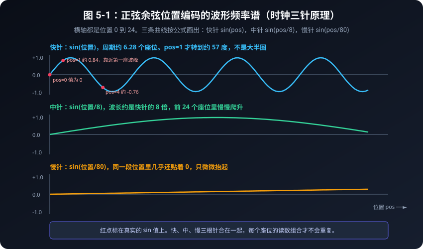

### 表 5-1：三大位置编码方案全景对比评测表

| 方案模式 | 具体做法 | 致命缺陷 | 最终评级 |
| :--- | :--- | :--- | :---: |
| **方案 1：整数序号递增** | 填入 `[1, 2, 3, ..., 1000]` | **数值爆炸**！后面的词数值太大，淹没语义特征；长句无法泛化。 | ❌ 淘汰 |
| **方案 2：归一化线性比例** | 填入 `pos / 总字数` | **步长飘忽不定**！3个字的句子步长0.33，100个字的句子步长0.01。 | ❌ 淘汰 |
| **方案 3：正弦余弦周期波** | 双波交替 $\sin(\omega t), \cos(\omega t)$ | 有界在 $[-1, 1]$ 内，高低频兼备；和角公式提供了表达相对距离的一条路径 | 原版 Transformer 的选择 |

---

### 表 5-2：前 8 个位置与前 8 个维度的真实位置编码数值表 (保留两位小数)

| 位置序号 $pos$ | 维度 d0 ($\sin$) | 维度 d1 ($\cos$) | 维度 d2 ($\sin$) | 维度 d3 ($\cos$) | 维度 d4 ($\sin$) | 维度 d5 ($\cos$) | 维度 d6 ($\sin$) | 维度 d7 ($\cos$) |
| :---: | :---: | :---: | :---: | :---: | :---: | :---: | :---: | :---: |
| **位置 0** | **0.00** | **1.00** | 0.00 | 1.00 | 0.00 | 1.00 | 0.00 | 1.00 |
| **位置 1** | **0.84** | **0.54** | 0.10 | 1.00 | 0.01 | 1.00 | 0.00 | 1.00 |
| **位置 2** | **0.91** | **-0.42** | 0.20 | 0.98 | 0.02 | 1.00 | 0.00 | 1.00 |
| **位置 3** | **0.14** | **-0.99** | 0.30 | 0.96 | 0.03 | 1.00 | 0.00 | 1.00 |
| **位置 4** | **-0.76** | **-0.65** | 0.39 | 0.92 | 0.04 | 1.00 | 0.00 | 1.00 |
| **位置 5** | **-0.96** | **0.28** | 0.48 | 0.88 | 0.05 | 1.00 | 0.00 | 1.00 |
| **位置 6** | **-0.28** | **0.96** | 0.56 | 0.83 | 0.06 | 1.00 | 0.01 | 1.00 |
| **位置 7** | **0.66** | **0.75** | 0.64 | 0.76 | 0.07 | 1.00 | 0.01 | 1.00 |

可以用计算器核对位置 1 的三根针（$d_{model}=8$）：

- 维度 0，$i=0$：$\sin(1 / 10000^{0}) = \sin 1 \approx 0.84$
- 维度 2，$i=1$：$\sin(1 / 10000^{2/8}) = \sin(0.1) \approx 0.10$
- 维度 4，$i=2$：$\sin(1 / 100) \approx 0.01$

d0、d1 正负跳得很快。d2 像分针，大约每个座位增加 0.10。d6、d7 在这 8 个座位里几乎不动。表中的 1.00 有时是四舍五入，例如位置 1 的 d3 实际约是 0.995。

---

### 表 5-3：位置 0 与后面各座位的余弦相似度（会回升，不是一条斜线）

| 比较对象 | 余弦相似度 | 相似度直方图可视化 | 语言几何学含义解读 |
| :---: | :---: | :--- | :--- |
| **位置 0 与 位置 0** | **1.000** | `█████████████████████████` | 自己和自己 |
| **位置 0 与 位置 1** | **0.884** | `██████████████████████` | 邻居，仍然很像 |
| **位置 0 与 位置 2** | **0.641** | `████████████████` | 继续拉开 |
| **位置 0 与 位置 3** | **0.491** | `████████████` | 这 8 个座位里的低谷 |
| **位置 0 与 位置 4** | **0.567** | `██████████████` | 快针开始往回转 |
| **位置 0 与 位置 5** | **0.790** | `███████████████████` | 相似度回升 |
| **位置 0 与 位置 6** | **0.946** | `███████████████████████` | 快针将近转完一圈 |
| **位置 0 与 位置 7** | **0.879** | `█████████████████████` | 仍然很高，但 d2 已经是 0.64，指纹并不相同 |

$\sin$ 和 $\cos$ 被锁在 $[-1, 1]$ 里，座位号再大，这组数字也不会像直接写 1000 那样把词向量淹没。
只看余弦不够：位置 0 和位置 6 的相似度高达 0.946，因为快针差不多转完一圈。要分辨它们，得看整列数字，尤其是 d2 那根慢针。

---

---

## 5.4 为什么三角函数能表达“相对距离”？高中的和角公式！

除了独一无二的绝对位置，语言更关心的是**相对距离**（比如“我”和后面第 2 个词的关系）。

为什么发明者偏偏挑选了一对 $\sin$ 和 $\cos$ 搭配，而不是只用 $\sin$ 呢？
**答案就是高一必修第二册最核心的三角恒等变换公式——和角公式！**

回忆高中数学公式：
$$\cos(\alpha + \beta) = \cos\alpha\cos\beta - \sin\alpha\sin\beta$$
$$\sin(\alpha + \beta) = \sin\alpha\cos\beta + \cos\alpha\sin\beta$$

令 $\alpha = pos \cdot \omega$，$\beta = k \cdot \omega$（其中 $k$ 代表两个词之间的相对距离，$k$ 步偏移）：
$$\sin((pos + k)\omega) = \sin(pos \cdot \omega)\cos(k\omega) + \cos(pos \cdot \omega)\sin(k\omega)$$

注意看等式右边：
对于任何固定的相对距离 $k$，$\cos(k\omega)$ 和 $\sin(k\omega)$ 都是**固定的常数**！
这意味着：**位置 $(pos + k)$ 的位置编码，完全可以通过位置 $pos$ 的编码进行一次简单的线性组合（矩阵乘法）直接推导出来！**

模型在学习“修饰词通常在名词前面 1 到 2 个位置”这种相对规律时，可以利用这个恒定关系，减少对每个绝对位置单独死记硬背的需要。

---

## 5.5 为什么是直接相加（Add），而不是拼接（Concat）？

还有一个困扰无数初学者的疑问：
> “把词向量和位置编码结合时，论文里居然写的是：$\vec{x}_{\text{最终}} = \vec{x}_{\text{词}} + \vec{x}_{\text{位置}}$。
> 直接做加法，难道不会把词语原本包含的‘苹果’、‘香蕉’等语义信息弄脏、污染了吗？为什么不拼成更长的向量？”

高维线性空间的几何直觉给出了令人惊叹的解释：

在现代大模型动辄 512 甚至 4096 维的高维空间中，**随机两个向量几乎是天生正交（垂直）的**。
这就像在一个浩瀚的立体三维房间里：
- 词语义信息主要分布在某些子空间维度上；
- 正弦余弦波浪主要分布在另一些方向上。

直接将它们相加，就像在平静的湖水表面激起了一圈微小的涟漪：
**鱼儿依然是鱼儿（词义保持），涟漪的方向则清晰地记录了水波的源头位置（位置保持）！**
模型内部的投影矩阵 $W_Q, W_K$ 可以学习如何区分两类信息；直接相加则避免把模型输入维度直接翻倍，通常能节省一部分参数和显存。

---

## 5.6 动手看代码与字符波浪热力图

打开 [code/05_positional_encoding.py](../code/05_positional_encoding.py)，我们用纯 Python 生成一个 8 位置、8 维度的位置编码矩阵并打印：

```python
def generate_positional_encoding(max_seq_len, d_model):
    pe = torch.zeros(max_seq_len, d_model)
    for pos in range(max_seq_len):
        # k 就是公式里的 i：第几对维度。不要再额外乘一次 2。
        for k in range(d_model // 2):
            div_term = math.pow(10000.0, (2 * k) / d_model)
            pe[pos, 2 * k] = math.sin(pos / div_term)
            if 2 * k + 1 < d_model:
                pe[pos, 2 * k + 1] = math.cos(pos / div_term)
    return pe
```

运行后在控制台打印出的字符热力图如下：

```text
Pos \ Dim | d0 d1 d2 d3 d4 d5 d6 d7
Pos  0    |  =  @  =  @  =  @  =  @ 
Pos  1    |  @  #  +  @  +  @  =  @ 
Pos  2    |  @  :  +  @  +  @  +  @ 
Pos  3    |  +     *  @  +  @  +  @ 
Pos  4    |  .  .  *  @  +  @  +  @ 
Pos  5    |     *  #  @  +  @  +  @ 
Pos  6    |  -  @  #  @  +  @  +  @ 
Pos  7    |  %  %  %  %  +  @  +  @ 
```

字符从左到右代表数值从 -1 到 +1。d0、d1 跳得厉害；d2 从 `=` 慢慢走到 `%`，这就是分针；d6、d7 几乎不动。

余弦相似度也不是一条笔直下降的斜线。位置 3 降到 0.491 之后，位置 6 又回到 0.946，因为最快的针周期约是 6.28，转到那里差不多绕回一圈。位置 0 和位置 6 仍然不是同一个指纹：d2 一个约是 0.00，另一个约是 0.56。

---

## 5.7 本章小结

- **置换不变性**是纯自注意力机制的天然缺陷，导致模型无法区分“小猫吃小鱼”与“小鱼吃小猫”。
- **直接编号**会导致数值爆炸，**归一化比例**会导致相对步长不一致。
- **正弦余弦位置编码**用快慢不同的波浪给每个位置一组有界（$[-1, 1]$）的读数。快针会周期性回头，所以余弦相似度会回升；认座位要看整列数字，不能只看一条下降的斜线。
- 利用高一**三角和角公式**，位置编码天然支持相对距离的线性推导。
- **直接相加**在不增加参数维度的前提下，把位置与词义放进同一组特征中交给后续层处理。

现在，我们有了词向量、多头自注意力，也有了位置编码。
我们该如何把它们封装成高耸入云的深度神经网络？
请看下一章：**积木组件——残差连接、层归一化与前馈神经网络**！


---

# 第6章：积木组件——残差连接、层归一化与前馈神经网络

> “一座巍峨的摩天大厦，不是一整块雕刻出来的巨石，而是由无数坚固标准、易于拼装的预制积木严密堆叠而成。”

---

## 6.1 残差连接（Residual Connection）：信息的高速公路

在深度学习的早期，研究人员发现了一个反常识的诡异现象：
**当一个神经网络越叠越深（比如叠到 50 层、100 层）时，模型的性能不但没有变聪明，反而变得越来越笨，甚至连最简单的训练题都做不对了！**

这是为什么呢？

### 生活比喻：传话游戏附带“录音笔”

想象一下，教导主任向 100 个学生依次传达一段紧急通知：
- 如果每个学生都凭借自己的嘴巴复述（经过复杂的神经网络层），经过 100 轮“加工”，最初的指令早就被曲解、稀释、忘得一干二净；
- 但如果教导主任给第一个学生发了一支**高清录音笔**，并规定一条铁律：
  > “每个学生在复述自己理解的同时，**必须把原始的录音笔原封不动地递给下一个人**！”

这就是 2015 年何恺明等学者提出的、获得计算机视觉最高荣誉的 **残差连接（Residual Connection）**！

```
              输入 x ─────────────┐ (原始录音笔: 抄近道)
                 │                │
                 ▼                │
          ┌─────────────┐         │
          │ 复杂神经计算 │         │
          │    F(x)     │         │
          └─────────────┘         │
                 │                │
                 ▼                ▼
                 [   相加求和: x + F(x)   ]
```

### 高中微积分直觉：为什么它能防止信息遗忘？

数学公式极其简单：
$$\text{Output} = x + F(x)$$
其中 $x$ 是输入，$F(x)$ 是注意力层或神经网络层的处理增量。

还没学过导数也可以读完这一段。你只要记住输出是“原样的 $x$”加上“旁边算出来的增量”。旁边那条路即使什么都没学会，原始信息也原封不动地送到了下一层。最差的情况是 $F(x)=0$，输出就等于输入。

学过导数的同学可以再看一行：输出对输入的变化率是
$$\frac{d(\text{Output})}{dx} = 1 + \frac{dF(x)}{dx}$$
就算后面那一项接近 0，前面仍有一个 1。这就是那条抄近道在变化率里留下的记号。它帮助误差信号穿过很多层，但不是说信号在任何情况下都丝毫不改。

---

## 6.2 层归一化（Layer Normalization）：全科成绩标准化

在神经网络一层层向上传递的过程中，成千上万个数字不断相乘、相加，很容易导致数值有的变成几千、有的变成 $0.00001$。
这就像一次考试，语文满分 100 分，数学突然冒出个 10,000 分，全班的总分体系将瞬间陷入崩溃。

为了让数据在每一层都保持清爽、稳定，我们必须进行**归一化（Normalization）**。

### 高二统计学回忆录：Z-Score 标准化

回忆高二数学选修课中的统计知识：
对于一组数据 $X = [x_1, x_2, \dots, x_d]$：

1. **计算平均数 $\mu$**：
   $$\mu = \frac{1}{d} \sum_{i=1}^d x_i$$
2. **计算方差 $\sigma^2$**：
   $$\sigma^2 = \frac{1}{d} \sum_{i=1}^d (x_i - \mu)^2$$
3. **标准化转换（Z-Score）**：
   $$\hat{x}_i = \frac{x_i - \mu}{\sqrt{\sigma^2 + \epsilon}}$$
   （其中 $\epsilon$ 是一个极小的数，如 $10^{-5}$，防止分母除以 0）

在 $\gamma=1$、$\beta=0$ 时，新数据的平均值会变成 0，方差会非常接近 1。分母里加了极小的 $\epsilon$，方差比 1 略小一点，打印到小数点后四位通常已经看不出来。这**不是**把数据变成正态分布：标准化只改均值和方差，原来歪的形状还是歪的。

4. **赋予自适应调整权（可学习参数）**：
   $$y_i = \gamma \cdot \hat{x}_i + \beta$$
   模型可以通过学习参数 $\gamma$（缩放）和 $\beta$（平移），自主决定是否把某些特征稍微放大或微调。

```
原始特征分布: 散乱无章 (均值可能=-3.5, 方差可能=42.0)
     │
     ▼  经过 (X - μ) / σ
均值约 0、方差约 1: 形状仍和原来同类
     │
     ▼  经过 γ * x + β
最佳表达形态: 模型自适应微调
```

---

### 表 6-1：BatchNorm vs LayerNorm vs RMSNorm 三大归一化全面对比表

| 对比维度 | BatchNorm (批归一化) | LayerNorm (层归一化) | RMSNorm (均方根归一化) |
| :--- | :--- | :--- | :--- |
| **归一化计算轴** | 跨 Batch 样本在单通道上算 | **单样本跨所有特征维度**算 | 单样本跨所有特征维度算 |
| **是否依赖 Batch 大小** | 训练时依赖批次统计，Batch 很小时统计会不稳定 | **不依赖 Batch 统计**（Batch=1 也能计算） | **不依赖 Batch 统计** |
| **是否计算平均值 $\mu$** | 是（算 $\mu$ 和 $\sigma^2$） | 是（算 $\mu$ 和 $\sigma^2$） | **否！直接砍掉 $\mu$，只算均方根** |
| **相对计算加速比** | 基准 | 基准 | **提速 10% ~ 50%（现代 LLaMA/DeepSeek 标配）** |
| **最契合的应用领域** | 计算机视觉（CNN） | 经典 NLP / Transformer | **现代万亿超大规模大模型** |

---


### 表 6-2：Pre-LN vs Post-LN 架构决战评测表

| 对比特性 | 经典 Post-LN (2017 原论文) | 现代 Pre-LN (GPT-3 / LLaMA / DeepSeek 标配) |
| :--- | :--- | :--- |
| **归一化摆放位置** | 放在注意力与 FFN **相加之后** | 放在注意力与 FFN **相加之前**（保护残差主干） |
| **梯度高速公路** | 残差主干中间经过归一化，深层训练通常更需要仔细调参 | 残差主干更直接，通常更容易优化；仍然需要合适的初始化、学习率和正则化 |
| **训练稳定性** | 常配合学习率预热等技巧；具体难度取决于深度和实现 | 往往更易训练，但不是“自动稳定”，超深网络仍需工程调参 |
| **深层模型扩展能力** | 经典架构仍然可以工作，只是深度增加时优化更敏感 | 常用于现代大模型，但“能堆多深”取决于整体设计，不是一个固定层数结论 |

---

## 6.3 前馈神经网络（FFN / MLP）：每个词的“闭门深思”

如果说**多头自注意力（Multi-Head Attention）**是让全班同学在走廊里“大声讨论、相互交流信息”，
那么交流完毕之后，每个同学都需要回到自己的座位上，**关起门来，独立消化思考**。

这个负责“闭门消化深思”的组件，就是 **前馈神经网络（Feed-Forward Network，简称 FFN）**。

### FFN 的内部构造：两层线性变换与非线性激活

FFN 的结构非常单纯直接，由两个全连接层和一个非线性激活函数（如 ReLU 或 GELU）组成：
$$\text{FFN}(x) = \text{Linear}_2(\text{Activation}(\text{Linear}_1(x)))$$

```
     输入词特征 (维度 d_model, 如 512)
           │
           ▼  Linear 1: 展开联想 (膨胀 4 倍!)
     隐层思考特征 (维度 4 * d_model, 如 2048)
           │
           ▼  Activation: 过滤杂念 (非线性思维跃迁)
     激活后特征 (维度 2048)
           │
           ▼  Linear 2: 降维总结 (浓缩回原状)
     输出新特征 (维度 d_model, 恢复 512)
```

### 为什么先放大 4 倍再缩回？

1. **升维思考（Expand）**：把 512 个维度的特征投影到 2048 维的大空间里，就像把一张折叠的藏宝图完全摊开，让各种细微的概念特征有足够的空间施展；
2. **非线性激活（Activation）**：如果只做加减乘除（线性运算），一百层网络等价于一层网络。非线性函数（比如只保留正数的 ReLU）让模型具备了逻辑判断能力（“如果条件成立则激活，否则置零”）；
3. **降维提炼（Contract）**：把膨胀的特征重新压榨、凝练回 512 维，沉淀出最核心的深层思想。

---

## 6.4 组装积木块：Transformer Block（Pre-LN 现代架构）

现在，让我们把所有的零件装配在一起，构成一个标准通用的 **Transformer 积木块（Block）**！

在 2017 年的原版论文中，归一化是放在加法之后的（Post-LN）；
但在现代顶尖大模型（如 GPT-3/4、LLaMA、DeepSeek）中，普遍采用了更稳定、更容易训练的 **Pre-LN（前置归一化）** 架构：

```
                    输入特征 x
                        │
         ┌──────────────┴──────────────┐
         │ (残差抄近道)                  ▼
         │                        [ LayerNorm 1 ]
         │                              ▼
         │                     [ 多头自注意力机制 ]
         │                              │
         ▼                              ▼
      [ 相加求和 + (第一阶段残差) ] ◄─────┘
         │
         ├─────────────────────────────┐
         │ (残差抄近道)                  ▼
         │                        [ LayerNorm 2 ]
         │                              ▼
         │                     [ 前馈神经网络 FFN ]
         │                              │
         ▼                              ▼
      [ 相加求和 + (第二阶段残差) ] ◄─────┘
                        │
                    输出特征 x'
```

### 观察积木块的绝妙对称性：
- **输入形状**：`[Batch, Seq_Len, d_model]`
- **输出形状**：`[Batch, Seq_Len, d_model]`
- **毫无变化！**

因为它的输入和输出形状完全一模一样，我们就可以像搭乐高积木一样：
叠 12 层（就是 GPT-2 Base）、叠 32 层（就是 LLaMA-7B）、叠 96 层（就是 GPT-3 175B）！

---

## 6.5 运行验证代码

打开 [code/06_transformer_block.py](../code/06_transformer_block.py)，运行后可以看到：

```text
LayerNorm 测试（检查第一个词的均值与方差）：
标准化前：均值=-0.1367, 方差=1.4284
标准化后：均值=0.0000 (≈0), 方差=1.0000 (≈1)

整块 Transformer Block 输出形状: torch.Size([2, 5, 16])
输入与输出的形状完全一模一样！这就是为什么我们可以像拼乐高积木一样，把它们堆叠几十层、几百层！
```

---

## 6.6 本章小结

- **残差连接**把原始输入原样加到后面。旁边的计算即使学坏了，信息也还有一条路可走。学过导数的话，这条路对应变化率里的那个 $+1$。
- **层归一化（LayerNorm）**利用高二统计学中的 Z-Score 标准化，平稳每个词在各维度的尺度，不需要把不同长度的句子混在一起统计。
- **前馈网络（FFN）**负责在注意力通信之后，进行“升维展开 -> 非线性激活 -> 降维提炼”的独立深思。
- **Transformer Block**将上述模块严密组装，实现了输入与输出形状恒定的标准化单元。

拥有了这块坚固的标准化积木，我们该如何用它来组装一个完整的“机器翻译”或“聊天生成”系统呢？
请看下一章：**编码器与解码器——从文本理解到自回归生成**！


---

# 第7章：编码器与解码器——从文本理解到自回归生成

> “一个负责深谋远虑地洞察全文，一个负责字斟句酌地构想未来。”

---

## 7.1 双雄对决：编码器（Encoder）与解码器（Decoder）

在经典的 Transformer 论文《Attention Is All You Need》中，模型被设计成一个由两座巨塔并立组成的庞大系统：
- **左塔：编码器（Encoder）**
- **右塔：解码器（Decoder）**

它们各自扮演什么角色？请看下表的全方位深度对比：

### 表 7-1：编码器 vs 解码器核心特性全景对比表

| 维度 | 编码器 (Encoder) | 解码器 (Decoder) |
| :--- | :--- | :--- |
| **形象比喻** | **试卷阅卷老师**（全面通读整篇文章） | **高考考场作家**（逐字构思写作文） |
| **核心使命** | **文本理解与特征提取** | **文本生成与自回归续写** |
| **注意力机制** | **双向自由自注意力**（每个词能看前后所有词） | **因果掩码注意力**（只能看自己和之前的词） |
| **是否有掩码** | 无因果掩码（全员 100% 畅通互联） | **严格施加下三角因果掩码**（严禁偷看未来） |
| **交叉注意力** | 无（只关心输入句子内部的交互） | **有 Cross-Attention**（作为桥梁汲取编码器知识） |
| **输入方式** | 一次性整句打包输入（全部词瞬间并行） | 生成时逐步自回归输入（生成一个词，塞回输入一个词） |
| **典型代表模型** | BERT、RoBERTa（擅长做分类、情感判断） | **GPT 系列、LLaMA、DeepSeek**（擅长对话聊天、写代码） |
| **双塔结合代表** | 经典机器翻译 Transformer、Google T5、BART | - |

---

## 7.2 宏观架构流程图

让我们通过宏观架构图，直观审视这两座巨塔是如何默契联动的：


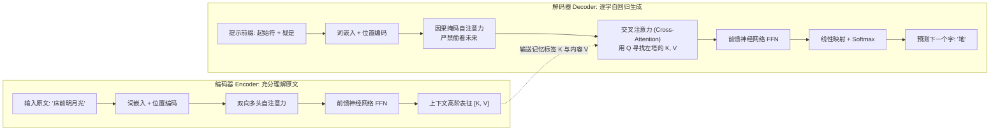

---

## 7.3 为什么解码器必须施加“因果掩码（Causal Mask）”？

许多初学者在自学大模型时都会问：
> “既然自注意力能让所有词互相交流，为什么解码器非要把未来的词遮挡住？这不是自废武功吗？”

### 闭卷考试与作弊警示

想象一下，如果在语文考试中，老师让你做“名句默写”：
- 题目写着：“春眠不觉晓，处处闻啼鸟。夜来风雨声，花落知______。”
- 如果在考试过程中，系统允许你**直接转头看向句末的‘少’字**；
- 那么在计算注意力时，空缺处的词向量就会直接拿‘少’字的特征交差！
- **后果**：模型在训练阶段“抄近道作弊”，一旦到了没有参考答案的真实应用场景中，它连一个字都生不出来！

为了杜绝这种“未来信息泄露”，解码器引入了 **因果掩码（Causal Mask / 下三角掩码）**！

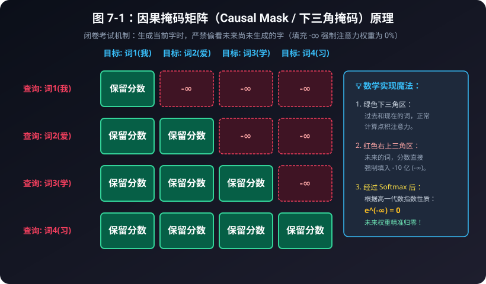

### 表 7-2：4 词序列的掩码矩阵数值演变推导表

假设输入序列为四个字：“我”、“爱”、“学”、“习”。

#### 1. 原始点积分数矩阵 (Q · K^T / √d_k)：
| 查询 (Query) \ 键 (Key) | 词1(我) | 词2(爱) | 词3(学) | 词4(习) |
| :--- | :---: | :---: | :---: | :---: |
| **词1(我)** | 2.15 | **1.80 (未来!)** | **0.95 (未来!)** | **0.40 (未来!)** |
| **词2(爱)** | 1.30 | 3.20 | **2.10 (未来!)** | **1.05 (未来!)** |
| **词3(学)** | 0.85 | 1.95 | 2.80 | **1.70 (未来!)** |
| **词4(习)** | 0.40 | 1.10 | 2.30 | 3.10 |

#### 2. 施加因果掩码后（未来位置强制填入 -1e9）：
| 查询 (Query) \ 键 (Key) | 词1(我) | 词2(爱) | 词3(学) | 词4(习) |
| :--- | :---: | :---: | :---: | :---: |
| **词1(我)** | 2.15 | $-\infty$ | $-\infty$ | $-\infty$ |
| **词2(爱)** | 1.30 | 3.20 | $-\infty$ | $-\infty$ |
| **词3(学)** | 0.85 | 1.95 | 2.80 | $-\infty$ |
| **词4(习)** | 0.40 | 1.10 | 2.30 | 3.10 |

#### 3. 最终 Softmax 注意力权重矩阵（百分比）：
| 查询 (Query) \ 键 (Key) | 词1(我) | 词2(爱) | 词3(学) | 词4(习) | 每行总和 |
| :--- | :---: | :---: | :---: | :---: | :---: |
| **词1(我)** | **100.0%** | **0.0%** | **0.0%** | **0.0%** | 100.0% |
| **词2(爱)** | **13.01%** | **86.99%** | **0.0%** | **0.0%** | 100.0% |
| **词3(学)** | **9.06%** | **27.23%** | **63.71%** | **0.0%** | 100.0% |
| **词4(习)** | **4.07%** | **8.19%** | **27.20%** | **60.54%** | 100.0% |

> [!NOTE]
> **用第 2 行把手算走一遍**：
> 允许看见的分数是 1.30 和 3.20。
> $e^{1.30} \approx 3.67$，$e^{3.20} \approx 24.53$，加起来约 28.20。
> 权重分别是 $3.67/28.20 \approx 13.01\%$ 和 $86.99\%$。
> 被写成 $-\infty$ 的格子贡献 $e^{-\infty} = 0$，所以未来的字不会分到百分比。
> 第 3、4 行用的是同一套算法。上面的原始分数是为了演示而写的，不是某个训练好的模型量出来的。

---

## 7.4 交叉注意力（Cross-Attention）：解码器与编码器的秘密对话

在双塔架构中，解码器不仅要审视自己已经写出的字，更要时刻对照编码器送过来的“原文参考资料”。
负责打通两座巨塔的枢纽，就是 **交叉注意力（Cross-Attention）**！

### Q、K、V 的跨界组装法则：
回忆我们在第 3 章学过的图书检索类比：
- **谁在发问？（Query 来自哪里？）**
  解码器正在写译文，它心里最清楚当前写到哪儿了、卡在哪个词上。因此：
  $$\mathbf{Q \ 来自 \ 解码器自身（Decoder）}$$
- **上哪儿去查参考答案？（Key 和 Value 来自哪里？）**
  原文的所有背景知识都在编码器肚子里。因此：
  $$\mathbf{K, V \ 来自 \ 编码器的最终输出（Encoder）}$$

```
   解码器 (Decoder) ──生成提问──► Q: "我接下来要翻译宾语了，原文的宾语是什么？"
                                  │
                                  ▼ (点积比对)
   编码器 (Encoder) ──提供标签──► K: ["主语:张三", "谓语:吃", "宾语:红富士苹果"]
                    ──提供实质──► V: [张三的特征, 吃的特征, 苹果的特征]
                                  │
                                  ▼ (加权提炼)
   解码器获得精准上下文 ───────► "抓取到了！宾语是'苹果'，英文应该输出 'apple'！"
```

这种机制让译文在生成时可以反复查询原文表示，通常比只依赖解码器自己的历史更容易保持与原文的对应；最终效果仍取决于训练数据和模型能力。

---

## 7.5 自回归生成机制（Autoregressive Decoding）：贪吃蛇的自循环

现在，我们来看 ChatGPT 和各种大模型在聊天时，那个“一闪一闪逐字打印”的打字机特效到底是怎么实现的。

这种生成方式叫做 **自回归（Autoregressive）**。
它的运行模式就像一盘**“贪吃蛇游戏”**：蛇每吃掉一颗豆子（生成一个新词），蛇的身体就变长一节，然后整条变长的蛇又作为新的输入，去寻找下一颗豆子！

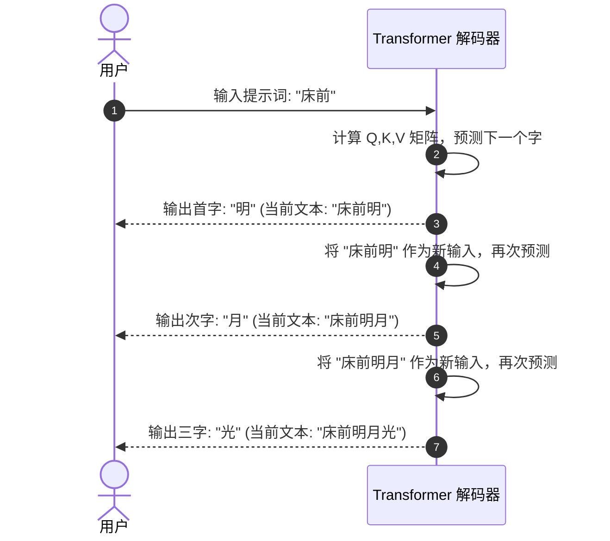

### 表 7-3：自回归生成每一步的数据流追踪表

| 步数 (Step) | 模型输入序列 (Input Sequence) | 预测下一个字的候选概率分布 (Top-3) | 采样选中的新字 | 拼接后的新序列 |
| :---: | :--- | :--- | :---: | :--- |
| **第 1 步** | `["床", "前"]` | 明: 92%, 地: 5%, 月: 3% | **明** | `["床", "前", "明"]` |
| **第 2 步** | `["床", "前", "明"]` | 月: 96%, 日: 2%, 星: 2% | **月** | `["床", "前", "明", "月"]` |
| **第 3 步** | `["床", "前", "明", "月"]` | 光: 98%, 照: 1%, 亮: 1% | **光** | `["床", "前", "明", "月", "光"]` |
| **第 4 步** | `["床", "前", "明", "月", "光"]` | ，: 99%, 。: 1% | **，** | `["床", "前", "明", "月", "光", "，"]` |

当模型预测出特殊的终止符（如 `<EOS>`，End of Sequence）或达到最大字数限制时，循环停止，一次流畅的人机对话就此圆满结束！

---

## 7.6 本章小结

- **编码器**拥有无拘无束的双向视界，专精于全文深刻理解；
- **解码器**受制于因果掩码，只能向左看，专精于自回归续写；
- **交叉注意力**让解码器用自己的 $Q$ 去匹配编码器的 $K$ 和 $V$，搭建起跨语言、跨模态的理解之桥；
- **自回归生成**通过“预测新词 -> 塞回输入 -> 预测下一个词”的贪吃蛇循环，实现了大模型灵动自然的创作输出。

现在，理论的拼图已经全部集齐！
在下一章中，我们将不再空谈理论，而是**手把手从第一行代码开始，亲自训练一个可以吟诵古诗的微型大模型（Baby-GPT）**！


---

# 第8章：实战——手搭一个微型大语言模型（Baby-GPT）

> “纸上得来终觉浅，绝知此事要躬行。没有什么比亲眼看着一行行代码从乱码训练到出口成章更令人震撼的了。”

---

## 8.1 我们的任务目标：诗词小才子 Baby-GPT

在本章中，我们将抛开一切复杂的工业级封装，从第一行代码开始，亲手搭建一个真正的、完整的自回归大语言模型——**Baby-GPT**！

我们让它学习李白《静夜思》、王之涣《登鹳雀楼》和孟浩然《春晓》。三首诗分开喂，不粘成一条。
训练前，给它“床前”，它会吐出乱码。训练 80 轮后，损失会降到接近 0，三个课文开头都能接回去。再给一个不是开头的“明月”，它就接错。请把这个限度一起看完。

---

## 8.2 模型超参数与配置规格表

为了让这个实验在普通笔记本的 CPU 上也能较快跑完，我们把数据和模型都控制得很小。实际耗时会随电脑、PyTorch 版本和线程数变化，不把“2 秒”当成硬性承诺：

### 表 8-1：Baby-GPT 架构超参数规格表

| 超参数名称 | 变量名 | 数值 | 通俗初学者解释 |
| :--- | :--- | :---: | :--- |
| **字符词表大小** | `vocab_size` | **57** | 训练诗句中所有出现过的不同汉字与标点总数 |
| **词向量特征维度** | `d_model` | **48** | 每个汉字用 48 个特征数字（坐标）来描述 |
| **注意力头数** | `num_heads` | **4** | 分成 4 个专家小分队，每个分队维度为 $48/4 = 12$ |
| **积木块层数** | `num_layers` | **2** | 堆叠 2 层 Pre-LN Transformer Block |
| **最大上下文窗口** | `max_seq_len` | **128** | 模型单次能够阅读和记忆的最长汉字数 |
| **学习率** | `learning_rate` | **0.01** | 每次梯度下山微调参数的步伐大小 |
| **总参数量** | `Parameters` | **67872** | 运行脚本时会打印这个整数。聊天模型的参数量比它大很多个数量级，GPT-4 的准确数字官方没有公布 |

---

## 8.3 数据流与模型前向传播全景图

下图清晰展示了一个汉字序列从输入、穿过积木块、直到预测下一个字的全部旅程：

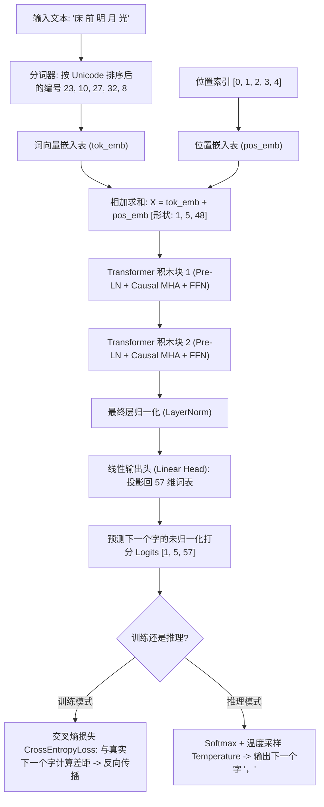

---

## 8.4 完整源代码深度精讲（保姆级逐行拆解）

让我们逐段拆解配套脚本 [code/07_baby_gpt.py](../code/07_baby_gpt.py)。

### 1. 词表与分词器（Tokenizer）

```python
# 训练语料：三首经典唐诗
text_corpus = (
    "床前明月光，疑是地上霜。举头望明月，低头思故乡。"
    "白日依山尽，黄河入海流。欲穷千里目，更上一层楼。"
    "春眠不觉晓，处处闻啼鸟。夜来风雨声，花落知多少。"
)

# 提取不重复汉字构建字典
unique_chars = sorted(list(set(text_corpus)))
vocab_size = len(unique_chars)  # 57 个字符
char2idx = {ch: i for i, ch in enumerate(unique_chars)}
idx2char = {i: ch for i, ch in enumerate(unique_chars)}
```

#### 表 8-2：部分汉字与数字 ID（运行脚本时的真实编号）

`sorted` 按 Unicode 编码排序。句号“。”排在汉字前面，全角逗号“，”排在汉字后面。这些编号只是座位号，没有“逗号比霜更大”这种含义。

| 汉字 | 数字 ID | 汉字 | 数字 ID | 汉字 | 数字 ID |
| :---: | :---: | :---: | :---: | :---: | :---: |
| **。** | 0 | **一** | 1 | **上** | 2 |
| **不** | 3 | **光** | 8 | **前** | 10 |
| **地** | 13 | **床** | 23 | **明** | 27 |
| **月** | 32 | **霜** | 52 | **，** | 56 |

所以“床前明月光”五个字的编号是 23、10、27、32、8。请用脚本打印核对，不要凭感觉给汉字编号。

---

### 2. 因果自注意力模块（CausalSelfAttention）

这是模型的“灵魂中枢”，注意看我们是如何将因果掩码注册进 PyTorch 缓冲区的：

```python
class CausalSelfAttention(nn.Module):
    def __init__(self, d_model, num_heads, max_seq_len):
        super().__init__()
        self.num_heads = num_heads
        self.head_dim = d_model // num_heads

        # 线性投影层
        self.W_q = nn.Linear(d_model, d_model, bias=False)
        self.W_k = nn.Linear(d_model, d_model, bias=False)
        self.W_v = nn.Linear(d_model, d_model, bias=False)
        self.W_o = nn.Linear(d_model, d_model, bias=False)

        # 核心：下三角掩码缓冲区（不需要计算梯度）
        mask = torch.tril(torch.ones(max_seq_len, max_seq_len))
        self.register_buffer("mask", mask)

    def forward(self, x):
        B, T, C = x.shape  # Batch(批次), Time(序列长度), Channel(维度)

        # 投影并切分多头: [B, num_heads, T, head_dim]
        Q = self.W_q(x).view(B, T, self.num_heads, self.head_dim).transpose(1, 2)
        K = self.W_k(x).view(B, T, self.num_heads, self.head_dim).transpose(1, 2)
        V = self.W_v(x).view(B, T, self.num_heads, self.head_dim).transpose(1, 2)

        # 点乘打分并缩放
        scores = torch.matmul(Q, K.transpose(-2, -1)) / math.sqrt(self.head_dim)
        
        # 施加掩码：将右上角未来位置填入 -1e9 (-∞)
        scores = scores.masked_fill(self.mask[:T, :T] == 0, -1e9)
        
        # Softmax 归一化
        weights = F.softmax(scores, dim=-1)
        
        # 加权求和并拼回原状
        out = torch.matmul(weights, V).transpose(1, 2).contiguous().view(B, T, C)
        return self.W_o(out)
```

---

### 3. 完整的 BabyGPT 模型组装

```python
class BabyGPT(nn.Module):
    def __init__(self, vocab_size, d_model=48, num_heads=4, num_layers=2, max_seq_len=128):
        super().__init__()
        self.max_seq_len = max_seq_len
        # 词嵌入，以及可学习的座位表。
        # 这不是第 5 章的 sin/cos。每个座位一行向量，数字在训练中自己学。
        self.tok_emb = nn.Embedding(vocab_size, d_model)
        self.pos_emb = nn.Embedding(max_seq_len, d_model)
        
        # 堆叠 2 层积木块
        self.blocks = nn.ModuleList([
            BabyBlock(d_model, num_heads, max_seq_len) for _ in range(num_layers)
        ])
        
        # 输出头
        self.ln_f = nn.LayerNorm(d_model)
        self.head = nn.Linear(d_model, vocab_size, bias=False)

    def forward(self, idx, targets=None):
        B, T = idx.shape
        pos = torch.arange(0, T, dtype=torch.long, device=idx.device)

        # 融合词义与位置
        x = self.tok_emb(idx) + self.pos_emb(pos)

        for block in self.blocks:
            x = block(x)

        x = self.ln_f(x)
        logits = self.head(x)  # [B, T, vocab_size]

        loss = None
        if targets is not None:
            # 高中概率交叉熵：衡量预测分布与真实字的差距
            loss = F.cross_entropy(logits.view(-1, logits.size(-1)), targets.view(-1))

        return logits, loss
```

训练循环不要把三首诗粘成一条。每一首单独算一次“猜下一个字”的损失，再取平均：

```python
encoded_poems = [torch.tensor(encode(poem), dtype=torch.long) for poem in poems]
losses = []
for data in encoded_poems:
    _, loss = model(data[:-1].unsqueeze(0), data[1:].unsqueeze(0))
    losses.append(loss)
loss = torch.stack(losses).mean()
```

`data[:-1]` 是输入，`data[1:]` 是紧挨着的下一个字。例如“床前明”，输入是“床前”，目标是“前明”。

---

## 8.5 训练过程与 Loss 下降实验数据表

运行训练后，模型在 80 个步长内展现出了惊人的学习速度：

三首诗**分开**训练，每首都从座位 0 开始，损失取三次的平均。随机种子是 42。如果把三首诗粘成一条，模型会只记住“第 i 个座位的下一个字”；这时提示“白日”仍会被放到第 0 号座位，于是接着背《静夜思》。

前馈网络用的是 GELU。它在 0 附近是一条平滑曲线。第 6 章的小演示用的是 ReLU，两种都能把积木跑通。

### 表 8-3：种子 42、三首诗分开训练时的损失

完全瞎猜下一个字时，损失大约是 $-\ln(1/57) = \ln 57 \approx 4.04$。第 1 轮测到的 4.1271 和这个数很接近。

| 训练轮次 | 损失值 | 这时实际发生了什么 |
| :---: | :---: | :--- |
| **第 1 轮** | **4.1271** | 接近盲目乱猜 |
| **第 20 轮** | **0.0196** | 三首课文的下一个字已经大体背出来 |
| **第 40 轮** | **0.0021** | 仍在把同一份课文背得更死 |
| **第 60 轮** | **0.0011** | 训练损失继续变小 |
| **第 80 轮** | **0.0009** | 对这三首诗的下一个字几乎没有误差 |

损失接近 0，是因为课文只有 72 个字，67872 个参数足够把它记住。这不是学会了作诗。

---

## 8.6 见证奇迹：真实生成效果对比

让我们看看训练前后的生成效果对比：

下表用的是贪心解码：每一步都选当前分数最高的字，所以种子 42 下每次运行都是这几句。温度大于 0 时会掷骰子，句子可能变化。

### 表 8-4：训练前后的贪心续写（每次再生成 15 个字）

| 输入提示 | 未训练 | 训练 80 轮后 |
| :--- | :--- | :--- |
| **床前** | `床前穷河前月眠欲黄头黄一日依疑，床` | `床前明月光，疑是地上霜。举头望明月` |
| **白日** | `白日穷河前月眠欲黄头黄一日依疑，床` | `白日依山尽，黄河入海流。欲穷千里目` |
| **春眠** | `春眠落头黄风白望入落欲一日依疑，床` | `春眠不觉晓，处处闻啼鸟。夜来风雨声` |

三个课文开头都能接回去。再试一个课文里有、但不是开头的提示：

`明月` → `明月不觉晓，处处闻啼鸟。夜来风雨声`

它没有接成“明月**光，疑是地上霜**”，而是滑进了《春晓》。小模型记住的是三首短课文的开头，不是“月光”这个意思。

> [!TIP]
> **关于采样温度（Temperature）的数学直觉**：
> 在生成代码中，有一行：
> `logits = logits / temperature`
> - 当 `temperature = 1.0` 时：保持原有概率；
> - 当 `temperature = 0.2` 时：所有得分被除以 0.2（相当于放大 5 倍！）。经过 Softmax 后，概率会更偏向当前最高分的字，模型通常更**保守、集中**，但不保证达到 100%；
> - 当 `temperature = 2.0` 时：分数差距被缩小，概率会更平均，模型通常更**随机**，也更容易生成训练语料里没有出现过的组合。

---

## 8.7 本章小结

在本章中，我们从 0 到 1：
1. 制作了一个字符级分词器；
2. 搭建了带因果掩码的多头自注意力层与完整的 Transformer 积木块；
3. 编写了训练循环与自回归生成函数；
4. 看到损失从 $4.13$ 降到 $0.0009$，以及这种下降的限度：三首诗的开头被背下来了，没学过的提示不会。

到这里，主干计算已经能亲手走通。
然而，真实世界中的 ChatGPT、Claude、DeepSeek 拥有上千亿参数，它们在此基础上又进化出了哪些现代武器？
请看最后一章：**走向未来——从经典 Transformer 到 GPT-4、DeepSeek**！


---

# 第9章：走向未来——从经典 Transformer 到 GPT-4、DeepSeek

> “科学不是一座静止的神庙，而是一条永不停息奔涌向前的大河。”

---

## 9.1 架构选择：为什么开放式生成常用 Decoder-Only？

在 2017 到 2020 年间，深度学习界曾有过激烈的“流派之争”：
- **Encoder-Only 派**：以 Google 的 **BERT** 为代表，专精于理解和分类；
- **Encoder-Decoder 派**：以 Google 的 **T5** 为代表，专精于机器翻译和摘要；
- **Decoder-Only 派**：以 OpenAI 的 **GPT 系列** 为代表，坚持纯自回归生成。

到了近几年的开放式聊天模型中，GPT、LLaMA、DeepSeek 等许多代表性系统采用 **Decoder-Only（仅解码器）**。这是适合“读完前文，继续预测下一个词”的工程选择，并不表示 Encoder-Only 或 Encoder-Decoder 已经没有用途。

### 三种架构各自擅长什么？

### 表 9-1：三大 Transformer 派系历史战役复盘表

| 架构流派 | 典型代表 | 训练任务 | 为什么被淘汰 / 为什么胜出？ |
| :--- | :--- | :--- | :--- |
| **Encoder-Only** | BERT、RoBERTa | 掩码填空、表示学习 | 很适合分类、检索和抽取；它不是为逐字生成而设计的，但经过改造也可以参与生成任务。 |
| **Encoder-Decoder** | T5、BART | 输入一段文本，再生成另一段文本 | 很适合翻译、摘要等“输入到输出”的转换任务，代价是需要维护两座互相配合的模块。 |
| **Decoder-Only** | GPT、LLaMA、DeepSeek | **预测下一个词 (Next-Token)** | 训练目标和开放式续写天然一致，结构简单，适合把同一个模型扩展到聊天、代码和长文本生成。 |

---

## 9.2 现代工业级大模型的五大进化杀手锏（高中数学通俗版）

从我们刚才手搓的 Baby-GPT，到今天掌控世界算力的千亿大模型，工业界在以下 5 个关键构件上进行了脱胎换骨的升级：

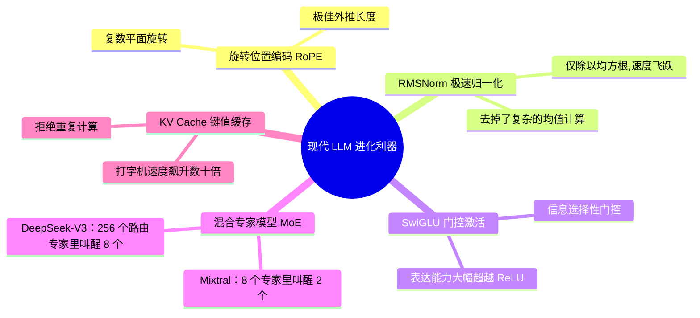

---

### 杀手锏 1：旋转位置编码（RoPE）——高一复数平面的几何旋转

在第 5 章中，我们学习了绝对正弦位置编码。但在处理长达 10 万字甚至 100 万字的长文本时，原版正弦编码的外推能力有限。

研究者苏剑林等人在 2021 年的论文 RoFormer 里提出了 **RoPE（Rotary Position Embedding，旋转位置编码）**。后来的 LLaMA、DeepSeek 都广泛使用它。

> [!NOTE]
> **用旋转矩阵，而不是和差化积**：
> 把二维向量 $(x, y)$ 旋转角度 $\theta$，就是乘下面这个矩阵：
> $$\begin{pmatrix} x' \\ y' \end{pmatrix} = \begin{pmatrix} \cos\theta & -\sin\theta \\ \sin\theta & \cos\theta \end{pmatrix} \begin{pmatrix} x \\ y \end{pmatrix}$$
> 
> **RoPE 在做什么**：
> - 第 $m$ 个座位上的 Query，旋转 $m\theta$；
> - 第 $n$ 个座位上的 Key，旋转 $n\theta$；
> - 做点积时，其中一个旋转可以先转回去。净效果只剩下相对角度 $(n-m)\theta$。
> 
> 绝对座位被消掉了，剩下两个字隔了多远。

---

### 杀手锏 2：RMSNorm——先不管平均数，只控制振幅

在第 6 章中，经典的 LayerNorm 需要先算平均数 $\mu$，再算方差 $\sigma^2$。

研究人员发现：让数据中心保持零均值其实没那么重要，真正起到稳定数值作用的，是**控制向量的整体振幅大小**！
于是，**RMSNorm（均方根归一化）** 应运而生：
$$\text{RMS}(x) = \sqrt{\frac{1}{d} \sum_{i=1}^d x_i^2}$$
$$\text{RMSNorm}(x) = \frac{x}{\text{RMS}(x)} \odot \gamma$$

它直接省去了计算均值的一整套步骤，将显存访问和计算时间压缩了 10% 到 50%，成为了现代模型的标配！

---

### 杀手锏 3：SwiGLU 激活函数——带有开关的神经元

传统模型使用 ReLU（只保留正数）。现代模型普遍换用了 **SwiGLU**。
它的直觉就像在电路中加了一个**“可调节亮度的电位器开关”**：
$$\text{SwiGLU}(x) = \big(\text{Swish}(x W_{\text{门}}) \odot (x W_{\text{上}})\big) W_{\text{下}}$$
这里的 $\odot$ 是两个向量**对应位置相乘**，不是点积，最后再乘输出矩阵。一条路准备内容，另一条路当开关：开关开多大，内容就通过多少。

---

### 杀手锏 4：混合专家架构（MoE）——DeepSeek 的低成本核武器

如果一个模型拥有 6710 亿总参数（例如 [DeepSeek-V3 技术报告](https://arxiv.org/abs/2412.19437)中的模型），每次回答一个字都让全部参数跑一遍，电费和硬件成本会非常高。MoE 的想法是：每个词只路由到少数专家。

DeepSeek 和 Mixtral 采用的 **MoE（Mixture of Experts，混合专家模型）** 改变了游戏规则：

```
                    输入当前词
                        │
                        ▼
               [ 路由器 Router ]
                        │
         ┌──────────────┴──────────────┐
         ▼ 本次参加                       ▼ 本次休眠
   DeepSeek-V3：叫醒 8 个路由专家     其余约 248 个路由专家不参加
   另外还有 1 个共享专家，每次都参加
         │
         ▼
   整个模型约 6710 亿参数
   每个词激活的大约是 370 亿参数
```

两套常见数字不要混在一起：
- **Mixtral**：一共 8 个专家，每个词叫醒其中 2 个。
- **DeepSeek-V3（技术报告中的版本）**：每层有 256 个路由专家，每个词选择其中 8 个，并配合共享专家；报告给出的总参数约 6710 亿、每个词激活约 370 亿。模型版本会更新，数字应以对应技术报告为准。

专家不是出厂就贴着“数学”“历史”的标签。路由器学的是“这个词更适合交给哪几个专家”，分工是训练出来的。

---

### 杀手锏 5：KV Cache 机制——消除重复运算的打字机

在自回归生成时，如果没有 KV Cache，生成每个新词都可能重新计算整段前缀的 $Q,K,V$ 和注意力。对长度为 $t$ 的这一步，注意力本身大约要处理 $t^2$ 个位置对；把每一步累加到长度 $N$，朴素实现的总工作量会接近 $O(N^3)$。

**KV Cache 的秘密**：
过去已经生成的词，在固定的上下文和模型参数下，它们的 **Key 和 Value 不需要重复计算**。模型把之前算好的 K 和 V 存在缓存里。每次生成新词时，只计算当前词的 Query，再与缓存中的历史 K、V 做一次注意力；长度为 $t$ 的单步工作量约为 $O(t)$，生成到长度 $N$ 的总注意力工作量约为 $O(N^2)$。KV Cache 消除的是重复计算，不会把长文本注意力变成常数时间。

---

## 9.3 顶级大模型架构进化对照表

下表汇总了自 2017 年以来最具代表性的大模型架构演进轨迹：

### 表 9-2：从经典 Transformer 到 DeepSeek 的参数与架构进化演变

| 特性 / 模型 | 经典 Transformer (2017) | GPT-2 (2019) | LLaMA 3 (2024) | DeepSeek-V3 (2024) |
| :--- | :---: | :---: | :---: | :---: |
| **基础架构** | Encoder-Decoder | Decoder-Only | Decoder-Only | **Decoder-Only (MoE)** |
| **归一化位置** | Post-LN (后置) | Pre-LN (前置) | Pre-LN (前置) | **RMSNorm (无均值)** |
| **位置编码** | 绝对正弦余弦 | 可学习绝对位置 | **RoPE (旋转位置)** | **RoPE (带多级扩展)** |
| **激活函数** | ReLU | GELU | **SwiGLU** | **SwiGLU** |
| **注意力机制** | 标准 MHA | 标准 MHA | **GQA (分组查询注意力)** | **MLA (多头潜在注意力)** |
| **专家机制** | 单体 Dense | 单体 Dense | 单体 Dense | **MoE (256 专家激活 8 个)** |
| **最大上下文** | 常见实现约 512 | 1024 | 8,192；后续 3.1 可到 128K | **128,000（128K）** |

---

## 9.4 尺度定律（Scaling Law）与神奇的“涌现现象”

最后，让我们回答一个终极哲学问题：
> “大模型到底为什么会产生像人类一样的推理、翻译和解题能力？”

2020 年，OpenAI 发现了震惊学术界的 **尺度定律（Scaling Law）**：
在不少受控实验中，随着**模型参数量（Model Size）**、**训练数据量（Dataset Size）** 和 **计算算力（Compute）** 一起增加，预测误差（Loss）会近似沿幂律下降；真实训练还会受到数据质量、优化方法和评测方式影响。

有人把某些能力在变大之后才明显表现出来，叫做**涌现**。这个说法要小心用：不同任务的转折点不一样；有的“突然变好”是因为评分只有对和错，中间的进步被尺子藏住了。更稳妥的观察是：参数、数据和算力一起变大时，预测下一个词的损失沿一条比较平滑的曲线下降。下面的图只表示“规模变大以后，有些困难任务开始做得动”，不是说跨过某一天就会自动会解物理竞赛。

```
预测下一个词的损失 ▲ 越高越差
         │ \
         │  \   小模型：损失高，困难任务经常做不动
         │   \
         │    \________  规模、数据、算力一起变大，损失大体平滑下降
         └────────────────────────────────► 规模
```

有些困难任务要到模型比较大时才开始做得动。这仍然是“预测下一个词”训练出来的结果，不是模型自动获得了一套和人类相同的心智。第 8 章那个只背三首诗的小模型，就是尺度还很小的时候。

---

## 9.5 本章小结

- **Decoder-Only** 因为训练目标和开放式续写很贴合，成为近年聊天与代码模型中的主流选择；
- **RoPE、RMSNorm、SwiGLU、MoE 与 KV Cache** 是现代顶级大模型兼顾超长文本、极致速度与低成本推理的五大基石；
- **尺度定律与涌现现象**揭示了大自然最底层的数学美感：极其纯粹简单的“预测下一个词”，在海量算力与优雅架构的催化下，绽放出了璀璨的通用人工智能火花！


---

# 附录：高中数学公式速查卡与深度学习黑话翻译词典

---

## 附录 A：大模型核心高中数学公式速查卡

恭喜你！读到这里，你已经发现：支撑当今天下所有大模型的底层数学工具，几乎全部来自你在高一、高二课堂上学过的知识点。
下表整理了全书涉及的核心高中数学公式与在大模型中的对应映射：

### 表 A-1：高中数学知识点与大模型机制对应速查表

| 高中知识点 | 数学教材公式 | 大模型应用场景 | 对应章节 |
| :--- | :--- | :--- | :---: |
| **平面与空间向量** | $\vec{a} = (x_1, x_2, \dots, x_n)$ | **词向量 (Word Embedding)**：把词语变成多维特征坐标点 | 第 1 章 |
| **向量模长（长度）** | $|\vec{a}| = \sqrt{\sum x_i^2}$ | 衡量词向量在特征空间里的强度大小 | 第 1 章 |
| **向量数量积（点乘）** | $\vec{a} \cdot \vec{b} = \sum a_i b_i$ | **注意力打分核心**：快速度量两个词的语义方向一致性 | 第 1、3 章 |
| **夹角余弦公式** | $\cos\theta = \frac{\vec{a} \cdot \vec{b}}{\|\vec{a}\| \|\vec{b}\|}$ | **余弦相似度**：度量两个词语、两篇文章的相似程度 | 第 1 章 |
| **指数函数** | $e^x \ (e \approx 2.71828)$ | **Softmax 归一化**：将任意实数映射为大于 0 的正数 | 第 3 章 |
| **概率归一化** | $P_i = \frac{e^{x_i}}{\sum e^{x_j}}$ | **注意力权重与词表预测**：把原始得分转化为和为 100% 的概率 | 第 3、8 章 |
| **均值与方差** | $\mu = \frac{1}{n}\sum x_i, \ \sigma^2 = \frac{1}{n}\sum (x_i - \mu)^2$ | **层归一化 (LayerNorm)**：将神经元特征拉到零均值和单位方差 | 第 6 章 |
| **独立随机变量方差加法** | $\text{Var}(X + Y) = \text{Var}(X) + \text{Var}(Y)$ | **缩放因子证明**：解释为什么注意力点积必须除以 $\sqrt{d_k}$ | 第 3 章 |
| **三角函数与周期** | $y = \sin(\omega t), \ T = \frac{2\pi}{\omega}$ | **正弦余弦位置编码**：通过高低频波浪给序列中的词发座位号 | 第 5 章 |
| **三角恒等变换和角公式** | $\cos(\alpha+\beta) = \cos\alpha\cos\beta - \sin\alpha\sin\beta$ | **相对位置线性外推**：解释为什么三角函数能表达相对距离 | 第 5 章 |
| **复数乘法与旋转矩阵** | $(x+iy) \cdot e^{i\theta} \leftrightarrow \begin{pmatrix}\cos\theta & -\sin\theta \\ \sin\theta & \cos\theta\end{pmatrix}$ | **RoPE 旋转位置编码**：现代 LLaMA/DeepSeek 的相对位置核心 | 第 9 章 |

---

## 附录 B：深度学习常见“黑话”大白话翻译词典

### 表 B-1：AI 行业黑话通俗翻译词典

| 深度学习黑话 | 英文原词 | 听起来像什么 | 大白话真实含义 |
| :--- | :--- | :--- | :--- |
| **张量** | Tensor | 高大上的量子物理？ | **多维数组**。0维是数字，1维是列表，2维是Excel表格，3维是带多个标签页的Excel。 |
| **词元 / Token** | Token | 代币、游戏币？ | 模型阅读的基本拼块。英文通常是半个或一个单词，中文通常是一个汉字或词组。 |
| **损失函数 / 损失值** | Loss | 赔了多少钱？ | **做错题的失分分值**。Loss 越小，说明模型预测得越准。 |
| **梯度下降** | Gradient Descent | 陡峭的悬崖？ | **盲人下山**。蒙着眼睛用脚感受哪个方向是下坡，顺着下坡方向小步移动调整参数。 |
| **过拟合** | Overfitting | 衣服太合身？ | **死记硬背**。模拟卷刷了 100 遍全考满分，一上高考考场遇到新题立刻考零分。 |
| **欠拟合** | Underfitting | 衣服太宽松？ | **根本没学会**。既没背过旧题，也看不懂新题，全靠瞎蒙。 |
| **自回归** | Autoregressive | 自动回归故乡？ | **贪吃蛇贪吃**。自己前面吐出来的字，又被吞进去作为输入，继续吐下一个字。 |
| **超参数** | Hyperparameter | 超级神秘参数？ | **模型出厂前的设定旋钮**。比如层数、头数、学习率，由人类工程师手工指定。 |
| **参数量** | Parameters Count | 智商数值？ | **模型肚子里拥有的神经元连接权重数量**。比如 7B 代表 70 亿个浮点数。 |
| **对齐** | Alignment | 排队站直？ | **后续训练立规矩**。常见做法包括人类反馈，目标是让回答更有帮助，并尽量少说有害或不诚实的话。 |

---

## 附录 C：后记与初学者进阶书单推荐

亲爱的同学：

当你读完这本小书时，你已经跨越了绝大多数成年人终其一生都未能跨过的认知鸿沟。你不再是一个只能把大模型当做魔法盲盒的普通使用者，而是一位亲手拆解过发条、洞悉其每一个齿轮咬合与数学法则的探索者。

人工智能的浪潮正在以惊人的速度重塑人类社会的一切。但请永远记住：
**再复杂的万亿大模型，其基石也不过是一次次纯粹的向量点积、一次次严谨的概率归一化，以及一行行充满敬畏的代码。**

### 进阶推荐阅读清单：
1. **原始论文**：《Attention Is All You Need》（Vaswani et al., 2017）——读完本书后，你可以尝试直接挑战这篇 2017 年的经典原作！
2. **经典视频**：3Blue1Brown 的神经网络系列，以及 2024 年的 *Attention in transformers, visually explained*。画面和公式对得上，适合看完本书后再看。
3. **开源项目**：Andrej Karpathy 的 `nanoGPT`——特斯拉前 AI 总监写的最简练优美的 GPT 实现。

愿你在未来的数学与科学征途上，始终保持对未知世界炽热的好奇心与探索的勇气！


---

